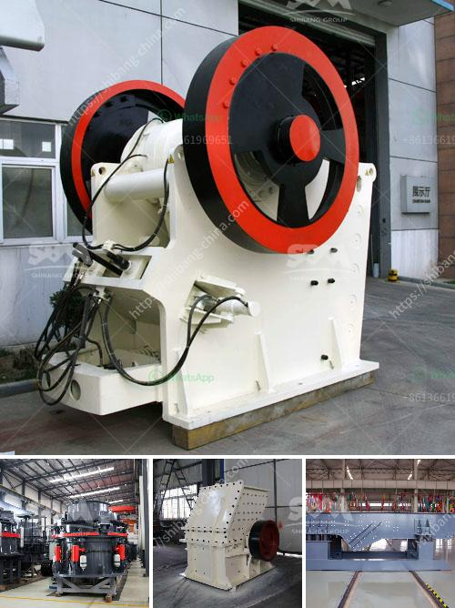

<h3>cone crusher for hire south africa</h3>
Crushing operations are required for a variety of materials and it is important to consider the overall process efficiency in order to achieve the desired product. The primary goal of a cone crusher is to reduce the size of the materials allowing further processing to take place. As South Africa's economy continues to grow, the demand for materials such as coal and iron ore also increases. With the construction industry being one of the major sectors driving the economy, the need for crushers is on the rise.

One of the popular types of crushers is the cone crusher due to its high efficiency and high processing capacity. However, this machine comes with a hefty price tag if you're looking to purchase one. Therefore, the option to hire a cone crusher for the project becomes a viable alternative for businesses in South Africa.

An advantage of cone crusher for hire South Africa is the ability to guarantee the final product quality. Cone crushers are equipped with a hydraulic setting adjustment system that allows for convenient and precise setting changes to be made. This can be done on the fly, ensuring the machine is always producing the required end product. With the use of a cone crusher, you can control the size of the material being produced, allowing for precise control of product specifications.

Furthermore, hiring a cone crusher also saves on additional costs such as transportation, maintenance, and storage. Once the project is completed, there is no need to worry about the machine sitting idle, taking up valuable space. Hiring allows for flexibility in terms of duration, ensuring you have the machinery needed for the duration of the project without any long-term commitments.

In conclusion, the option to hire a cone crusher for projects in South Africa provides many advantages, such as guaranteed final product quality, flexibility in terms of duration, and cost-saving on additional expenses. These benefits make cone crushers a valuable asset in the construction industry, contributing to the growth of South Africa's economy.
<h3>Contact us</h3><ul><li><strong>Whatsapp:&nbsp;<a href="https://wa.me/8613661969651">+8613661969651</a></strong></li><li><a href="https://swt.shibang-china.com/?git&amp;zhl&amp;cone crusher for hire south africa"><strong>Online Service(chat now)</strong></a></li></ul><h3>Related</h3><ul><li><a href='small sized cement plant project cost in india.md'>small sized cement plant project cost in india</a></li><li><a href='sell crusher of jaw in peru.md'>sell crusher of jaw in peru</a></li><li><a href='dolomite roller mill.md'>dolomite roller mill</a></li><li><a href='stone crusher kapasitas 150m.md'>stone crusher kapasitas 150m</a></li><li><a href='complete mobile stone crushing machine.md'>complete mobile stone crushing machine</a></li></ul>