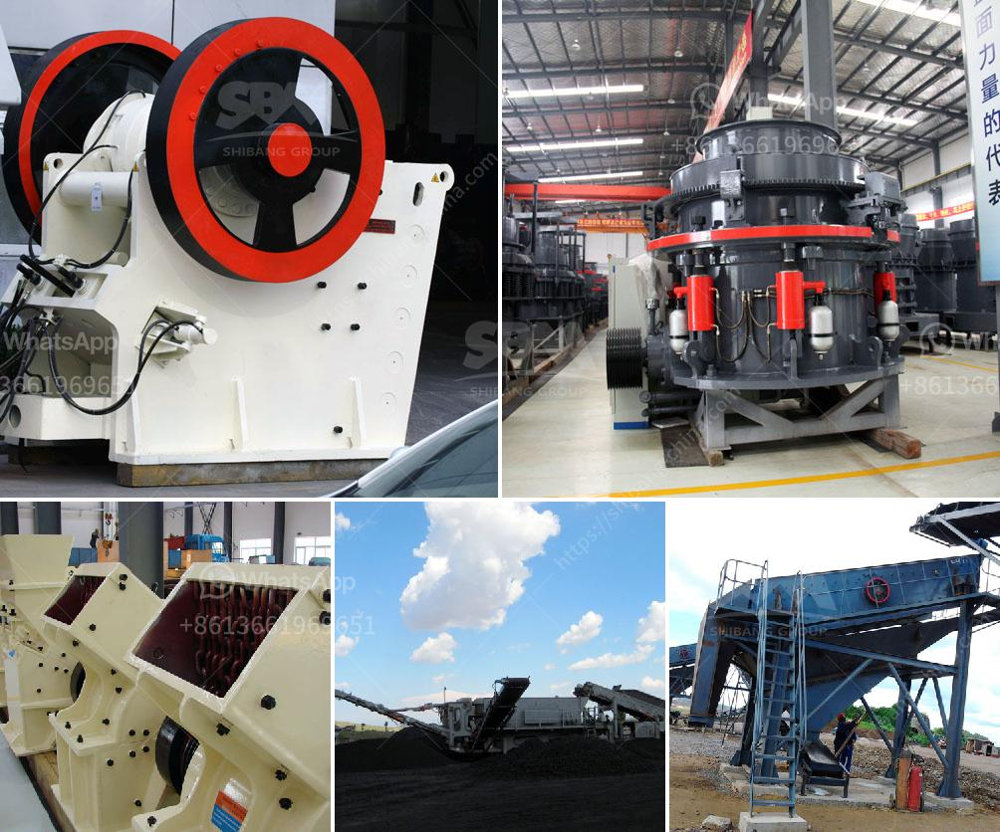

<h3>cone crusher for sale in uae</h3>
Cone crusher is a common crushing equipment that is used for breaking medium-hard and above hardness stone materials. Cone crusher is widely used in mining, smelting, building materials, road construction, chemical industry and other fields. It is suitable for crushing hard and medium-hard ores and rocks, such as iron ore, limestone, copper ore, quartz, granite, sandstone, etc.

In the UAE, cone crusher is often used in large-scale mineral processing lines. Together with the other crushing and screening equipment, cone crusher has the advantages of high efficiency, high capacity, low operation cost, easy adjustment, and economical use. Today, we will briefly introduce the cone crusher for sale in UAE.

It is mainly composed of frame, transmission device, eccentric bushing, hydraulic system, and other components. The motor drives the eccentric bushing to rotate through the transmission device, making the crushing cone move in a predetermined trajectory. When the material enters the crushing cavity from the feeding port, it is impacted, squeezed, and bent by the moving and fixed cones. After multiple collisions, extrusions, and bending, the material is crushed to the required particle size and discharged through the lower discharge opening.

The cone crusher for sale in UAE adopts the principle of laminating crushing. The greater the crushing force is, the higher the crushing effect is. In addition, the surface area of the crushing cavity has a significant effect on the production capacity of the crusher. The material is crushed in the crushing cavity composed of the moving cone and the fixed cone. The mobile cone has a certain rotating speed, which continuously presses and crushes the material placed on the crushing wall until the material is broken.

The cone crusher for sale in UAE uses the principle of laminating crushing to crush materials. The moving cone continuously presses the material in the crushing chamber against the fixed cone, thereby achieving the crushing effect. The structure of the cone crusher machine for sale is reasonable, and it adopts the hydraulic system for convenient operation and adjustment.

The hydraulic cone crusher is a new type of cone crusher that is optimized by our company to combine the advantages of single-cylinder hydraulic cone crusher and PSG cone crusher. The high-performance crushing cavity type and the high crushing frequency are combined to make the processing capacity of the machine greatly improved. Due to the principle of laminating crushing, the crushed products are mostly cubic structures, which greatly reduces the needle-like materials.

In summary, the cone crusher machine for sale in UAE has a wide application range, which has been highly recognized by the majority of customers. The cone crusher is not only suitable for secondary crushing medium-hard materials, but also suitable for fine crushing powdery materials and brittle materials with different properties. Therefore, it has wide applications in mining, smelting, building materials, chemical industry, and other fields. With the constant improvement of crushing technology, cone crushers are also evolving toward automation, intelligence, and high performance.
<h3>Contact us</h3><ul><li><strong>Whatsapp:&nbsp;<a href="https://wa.me/8613661969651">+8613661969651</a></strong></li><li><a href="https://swt.shibang-china.com/?git&amp;zhl&amp;cone crusher for sale in uae"><strong>Online Service(chat now)</strong></a></li></ul><h3>Related</h3><ul><li><a href='vibrating screens 250tph.md'>vibrating screens 250tph</a></li><li><a href='used jaw crusher for sale.md'>used jaw crusher for sale</a></li><li><a href='blands of quarry crusher plant ball mill.md'>blands of quarry crusher plant ball mill</a></li><li><a href='cement clinker grinding and packing plant.md'>cement clinker grinding and packing plant</a></li><li><a href='gyratory crusher advantages and disadvantages.md'>gyratory crusher advantages and disadvantages</a></li></ul>