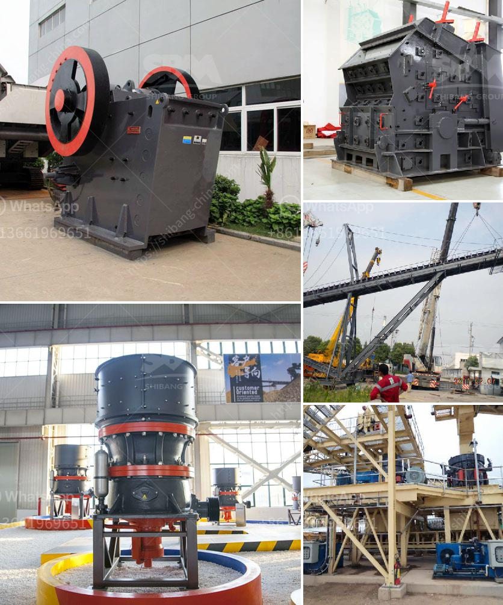

<h3>cone crusher in china cone</h3>
The capacity of a cone crusher is determined by the size of its crushing chamber. The larger the chamber, the more powerful and productive the crusher becomes. With the upcoming construction season in full swing, the demand for cone crushers is expected to surge in China. The cone crusher market in China is valued at USD XX million in 2020 and is projected to reach USD XX million by the end of 2025, growing at a CAGR of XX% during the period 2020 to 2025. 

As the world's largest producer and consumer of cement, China has a huge demand for aggregates, which are primarily used in the construction industry. Cone crushers play a crucial role in this process by reducing the size of the raw materials into smaller, more manageable pieces. This helps in enhancing the efficiency of the construction process as well as reducing the overall cost of the project. 

China is undergoing rapid urbanization and infrastructure development. The government's push for the "Belt and Road Initiative" has led to an increase in the number of construction projects across the country. This has created a massive demand for cone crushers in China. Additionally, the government's focus on upgrading the country's transportation and energy infrastructure has further fueled the demand for cone crushers.

Chinese cone crushers have gained a reputation for their reliability, durability, and efficiency. They are widely used in various applications such as mining, quarrying, and recycling. These crushers are designed to handle a wide range of materials, including hard and abrasive ones, and can produce a high-quality end product with excellent particle shape.

In recent years, Chinese manufacturers have made significant advancements in cone crusher technology. They have introduced innovations such as hydraulic clearing, hydraulic adjustment, and automated controls, which have improved the overall efficiency and performance of these crushers. Additionally, the use of advanced materials and manufacturing techniques has led to the production of more durable and reliable cone crushers.

Moreover, Chinese cone crushers are cost-effective compared to their counterparts from other countries. The competitive pricing of Chinese crushers has made them more affordable and accessible to construction companies, even those with limited budgets. This has further contributed to the increasing demand for cone crushers in China.

However, it is important to ensure that the cone crusher is produced by a reputable manufacturer. The market in China is flooded with numerous crusher suppliers, making it essential to choose a reliable and experienced manufacturer. Buyers should conduct thorough research, check customer reviews, and visit manufacturer facilities to ensure the quality and reliability of the cone crushers they purchase.

In conclusion, cone crushers are playing a pivotal role in China's infrastructure construction. With the growing demand for aggregates and the government's push for infrastructure development, the cone crusher market in China is expected to witness substantial growth. Chinese cone crushers offer a cost-effective solution for construction companies, thanks to their reliability, durability, and efficiency. As a result, the cone crusher market in China is set to become even more competitive in the coming years.
<h3>Contact us</h3><ul><li><strong>Whatsapp:&nbsp;<a href="https://wa.me/8613661969651">+8613661969651</a></strong></li><li><a href="https://swt.shibang-china.com/?git&amp;zhl&amp;cone crusher in china cone"><strong>Online Service(chat now)</strong></a></li></ul><h3>Related</h3><ul><li><a href='grinding coal mill.md'>grinding coal mill</a></li><li><a href='cara pemasangan belt conveyor.md'>cara pemasangan belt conveyor</a></li><li><a href='best mobile jaw crusher 30 100tph.md'>best mobile jaw crusher 30 100tph</a></li><li><a href='gravel crushers for sale in.md'>gravel crushers for sale in</a></li><li><a href='manganese crusher production line.md'>manganese crusher production line</a></li></ul>