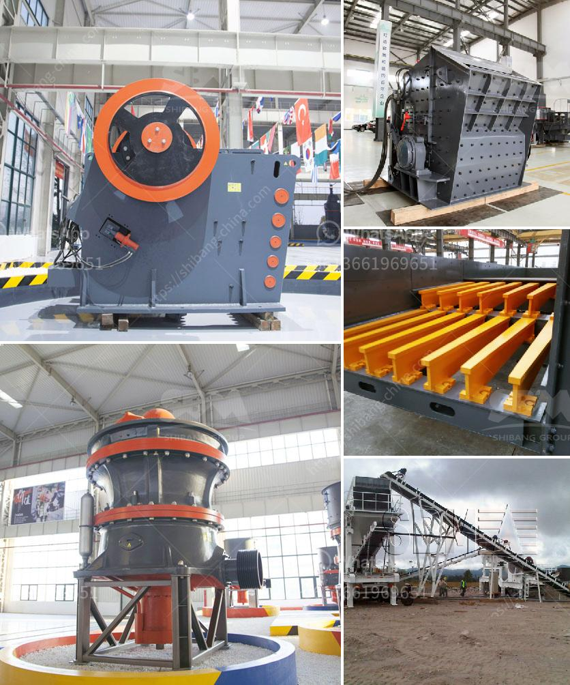

<h3>cone crusher in mexico</h3>
Cone crushers have become a vital equipment in mining, construction, and aggregate processing industries. They are categorized based on the crushing cavity type and cone diameter. The cone crusher was invented by the Symons brothers in the 1920s and revolutionized the mining industry, enabling higher production volumes and more efficient size reduction. In Mexico, cone crushers have garnered significant popularity due to their ability to process various materials and improve overall operational efficiency.

In Mexico, cone crushers are widely utilized in the crushing of diverse materials such as granite, basalt, iron ore, and diamond ore, to name a few. These materials are transformed into smaller grains by the continuous compression and crushing process performed by the cone crusher's mantle. Manufacturers have designed different cone crusher models to suit specific material requirements, ensuring unmatched versatility and adaptability.

Cone crushers in Mexico offer various advantages such as improved crushing capacity, better operational efficiency, reduced wear and tear, and low maintenance requirements. With the advancements in technology and engineering, cone crushers are equipped with features that enhance their performance. These advancements include automated systems, hydraulic chambers clearing, and intelligent control systems, ensuring high productivity and minimal downtime.

The cone crushers in Mexico also offer cost-effective solutions for businesses operating in the mining and construction sectors. With their ability to produce multiple high-quality products, cone crushers eliminate the need for additional equipment and reduce overall project costs. Moreover, the low energy consumption of cone crushers contributes to lowering operational costs throughout their lifespan.

Cone crushers in Mexico are built to withstand extreme conditions and harsh environments commonly found in mining and construction sites. They are constructed using heavy-duty materials and feature robust components, ensuring reliable operation even in challenging conditions. This durability reduces the risk of unexpected breakdowns and increases the overall lifespan of the machine.

As sustainable practices gain prominence, businesses in Mexico are increasingly focusing on reducing their environmental impact. Cone crushers contribute to this goal by offering a cleaner and more environmentally friendly solution. The ability to produce high-quality aggregates reduces the need for additional processing, thereby lowering dust, noise, and emissions generated during mining and crushing operations.

The cone crusher has become an integral part of the Mexican mining and construction industries due to its versatility, enhanced efficiency, and cost-effectiveness. It has revolutionized the way materials are processed and transformed into valuable products. Cone crushers offer reliable and long-lasting performance, allowing businesses to optimize their operational processes and achieve higher production volumes. As Mexico continues to witness significant growth in its mining and construction sectors, cone crushers are expected to play a crucial role in meeting the country's evolving needs while adhering to sustainability principles.
<h3>Contact us</h3><ul><li><strong>Whatsapp:&nbsp;<a href="https://wa.me/8613661969651">+8613661969651</a></strong></li><li><a href="https://swt.shibang-china.com/?git&amp;zhl&amp;cone crusher in mexico"><strong>Online Service(chat now)</strong></a></li></ul><h3>Related</h3><ul><li><a href='jaw crusher structure.md'>jaw crusher structure</a></li><li><a href='impact crusher suppliers.md'>impact crusher suppliers</a></li><li><a href='desain hammer mill dengan pelat rotor pdf.md'>desain hammer mill dengan pelat rotor pdf</a></li><li><a href='fluorite processing.md'>fluorite processing</a></li><li><a href='lime stone crusher.md'>lime stone crusher</a></li></ul>