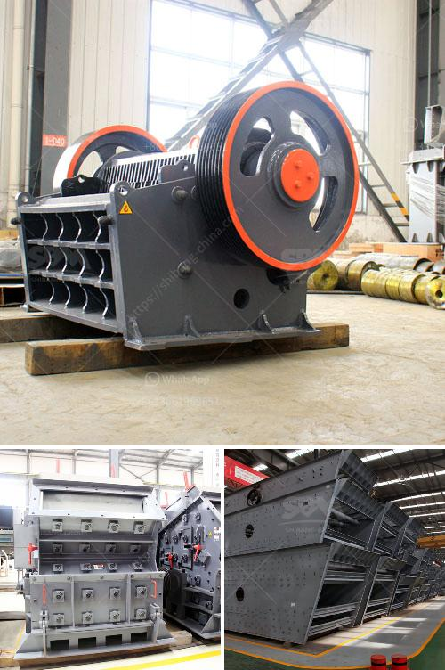

<h3>cone crusher made in italy</h3>
Title: The Superiority of Italian-Made Cone Crushers: Unleashing the Potential of Crushing Efficiency

When it comes to crushing equipment, the utilization of cone crushers is undeniable. Cone crushers greatly expand the field of coarse and fine crushing, delivering efficient and high-quality results. As a vital piece of machinery, cone crushers bring numerous benefits and advantages to various industries. Notably, Italian manufacturer companies have made significant strides in the production of outstanding cone crushers. In this article, we will explore the excellence of cone crushers made in Italy, highlighting their exceptional features, durability, and reliability.

Italian-made cone crushers are renowned for their exceptional design, engineering, and precision. Italian manufacturers, such as FTM Machinery, produce cone crushers that showcase advanced technology, ensuring reliable performance and superior crushing capabilities. The Italian approach to design focuses on functionality, durability, and efficiency, resulting in highly reliable machinery.

Italian cone crushers incorporate cutting-edge crushing technology to deliver efficient and precise results. These machines utilize advanced hydraulic systems, providing smooth and precise adjustments to achieve the desired product size. With accurate control over the crushing process, Italian cone crushers minimize the risk of over-crushing, promoting greater efficiency and reducing wear and tear on components.

Durability is a key factor to consider when investing in cone crushers, as they are subjected to high-intensity workloads and harsh operating conditions. Italian manufacturers have gained a stellar reputation for producing cone crushers that withstand the harshest environments, offering longevity and minimizing downtime. Robust construction, high-quality materials, and meticulous craftsmanship ensure Italian-made cone crushers outlast their counterparts, translating into reliable long-term performance and reduced maintenance costs.

Cone crushers made in Italy excel in their ability to adapt to different crushing tasks. Designed for a wide range of applications, Italian-made crushers can significantly enhance productivity while minimizing unnecessary downtime. Whether crushing hard rocks, aggregates, or minerals, Italian cone crushers deliver exceptional performance, making them suitable for a variety of demanding crushing operations.

Italian-made cone crushers have garnered global recognition and garnered success stories across various industries. Leading companies worldwide have entrusted their crushing needs to Italian manufacturers, yielding excellent results. The reliability, efficiency, and versatility of these machines have been instrumental in improving productivity, reducing overall operational costs, and achieving higher quality end products.

The Italian-made cone crushers represent an undeniable testament to the country's prowess in engineering and manufacturing. With their high-quality materials, advanced hydraulic systems, and superior design, these cone crushers guarantee exceptional performance, durability, and adaptability. Investing in Italian-made cone crushers provides industries with a reliable solution to their crushing needs while increasing productivity and realizing cost savings.

As the global demand for efficient and reliable crushing machines continues to grow, Italian manufacturers stand ready to meet these challenges head-on, offering cone crushers that set new standards in functionality, durability, and performance.
<h3>Contact us</h3><ul><li><strong>Whatsapp:&nbsp;<a href="https://wa.me/8613661969651">+8613661969651</a></strong></li><li><a href="https://swt.shibang-china.com/?git&amp;zhl&amp;cone crusher made in italy"><strong>Online Service(chat now)</strong></a></li></ul><h3>Related</h3><ul><li><a href='south africa jaw crushers.md'>south africa jaw crushers</a></li><li><a href='stone crusherproduction line.md'>stone crusherproduction line</a></li><li><a href='complete mobile stone crushing machine.md'>complete mobile stone crushing machine</a></li><li><a href='used 3 ft cone crusher.md'>used 3 ft cone crusher</a></li><li><a href='50tpd slag cement grinding unit cost.md'>50tpd slag cement grinding unit cost</a></li></ul>