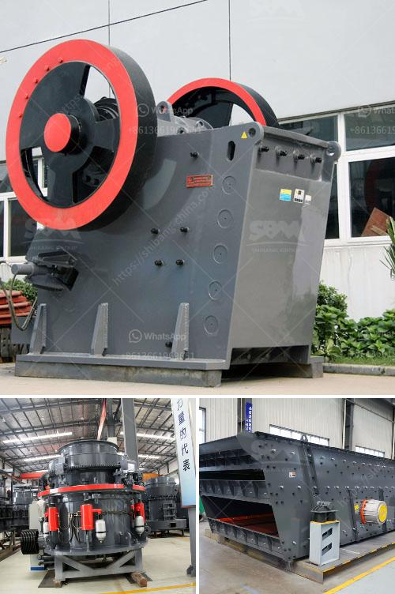

<h3>cone crusher manufacturers china</h3>
Cone crushers are commonly used for secondary and tertiary crushing stages in the aggregate and mining industry. It has been recognized as a high-efficiency crushing equipment by customers worldwide. And this is partly due to the advanced technology development in China. With the rapid growth of the Chinese economy, the country has become one of the world's largest manufacturing hubs, including cone crusher manufacturers.

China is a big country with abundant resources of stone and mineral resources. There are many crusher manufacturers in China, providing various crusher machines for mining industry. SBM is world leading supplier and manufacturer of sand crushing plant. We provide complete range of manufactured sand crushing machinery in China, including jaw crusher, impact crusher, cone crusher, gyratory crusher, VSI crusher etc. The sand making machine can be equipped with sand screening plant, washing machine and drying plant to be a complete sand production line. We have installed thousands of sand production lines in India.

Mine crusher manufacturers are even more in China. At present, there are many crusher manufacturers in China. Among them, SBM, along with other domestic manufacturers like Sany, Broad, NHI, CITIC and Shuozhou Machine, has joined the ranks of foreign suppliers. However, compared to these foreign manufacturers, China's cone crusher manufacturers are not mature enough, and there are still some gaps in product quality and process control. In order to reduce the gap, China's manufacturers need to make significant breakthroughs in quality control and process improvement.

One of the key areas that manufacturers need to focus on is the improvement of cone crusher wear parts, which directly affects the performance and quality of cone crushers. The traditional cone crusher wear parts mainly include liners and mantles. Although these wear parts have a good performance in crushing materials, they are prone to wear and need to be replaced frequently, resulting in high maintenance costs. Therefore, manufacturers in China should focus on improving the wear-resistant materials and design of the wear parts to increase their service life and reduce maintenance costs.

Another area for improvement is the technology used in cone crushers. Currently, most cone crushers in China are based on the imitation of foreign products, and there is limited innovation in the design and manufacturing techniques. Chinese manufacturers need to enhance their research and development capabilities to create cone crushers with higher technological content, better performance, and overall higher efficiency.

In conclusion, although there are many cone crusher manufacturers in China, the overall level is not very outstanding compared with other countries. To compete with well-known brands in the international market, Chinese manufacturers need to improve their product quality and technological innovation. Only by continuously investing in research and development, improving manufacturing techniques, and enhancing quality control, can China's cone crusher manufacturers become more competitive and serve their customers better.
<h3>Contact us</h3><ul><li><strong>Whatsapp:&nbsp;<a href="https://wa.me/8613661969651">+8613661969651</a></strong></li><li><a href="https://swt.shibang-china.com/?git&amp;zhl&amp;cone crusher manufacturers china"><strong>Online Service(chat now)</strong></a></li></ul><h3>Related</h3><ul><li><a href='iron ore mobile crusher.md'>iron ore mobile crusher</a></li><li><a href='calcium carbonate grinding.md'>calcium carbonate grinding</a></li><li><a href='gypsum crusher manufacturing in odisha.md'>gypsum crusher manufacturing in odisha</a></li><li><a href='lime and dolomite plant sale.md'>lime and dolomite plant sale</a></li><li><a href='gypsum crusher in salalah oman.md'>gypsum crusher in salalah oman</a></li></ul>