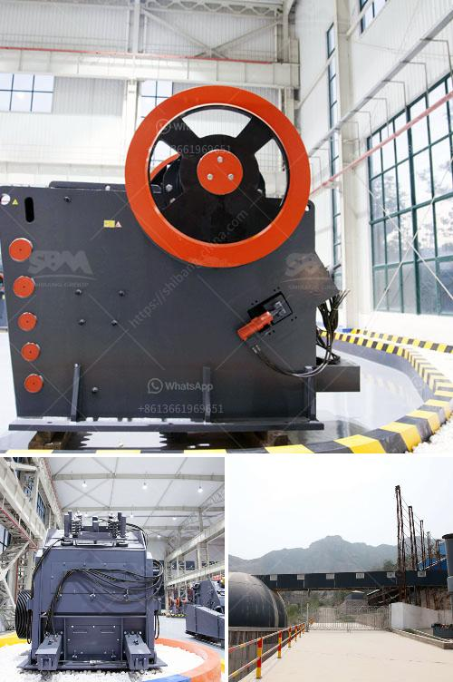

<h3>cone crusher middle east</h3>
The Cone Crusher Market in the Middle East is growing at a steady pace due to the increasing demand for secondary and tertiary crushing and the expanding construction industry. With the rising need for finer and more accurate crushing procedures, the need for the role of crushing equipment is expanding rapidly.

The Middle East is one of the fastest-growing regions in the world, and the construction industry is one of the key contributors to this growth. With extensive projects taking place to build roads, highways, bridges, dams, and buildings, the demand for construction materials such as cement, sand, aggregates, and concrete is rising exponentially.

This surge in construction activities in the Middle East has led to a significant increase in the demand for cone crushers. Cone crushers are widely used in the mining industry for processing quarried materials and heavy mining substances. With the additional advantage of transportation to the required location and maneuvering the equipment within the site, the cone crusher's demand is expected to rise.

Cone crushers offer several benefits compared to other types of crushing equipment. It has a high crushing ratio, high efficiency, low energy consumption, uniform product size, and is suitable for both fine and coarse crushing. These advantages make it a suitable choice for crushing various high-hardness materials in the Middle East.

The Middle East region is witnessing a rapid growth in the infrastructure sector due to the increasing population, urbanization, and industrial development. The governments in countries like Saudi Arabia, UAE, Qatar, and Kuwait are implementing extensive infrastructure development plans, which include construction of roads, railways, airports, and residential and commercial buildings.

These infrastructure projects require a significant amount of construction materials, which can be achieved through the use of cone crushers. Cone crushers help in achieving desired particle size distribution and shape without generating excessive fines, which ultimately reduces the overall cost of construction and improves efficiency.

Furthermore, cone crushers are equipped with automatic setting regulation systems that allow the operator to adjust the crusher settings to ensure consistent product size and quality. This feature is particularly beneficial in the Middle East, where the availability of skilled labor for manual adjustment may be limited. The automated systems also help in reducing downtime and increasing productivity.

Several leading manufacturers in the cone crusher market are focusing on developing advanced cone crushers to offer higher productivity rates, reduce maintenance requirements, and enhance overall operational efficiencies. They are also investing in research and development activities to introduce innovative technologies that can meet the specific requirements of the Middle East's construction industry.

In conclusion, the cone crusher market in the Middle East is witnessing steady growth due to the increasing demand for secondary and tertiary crushing equipment, driven by the expanding construction industry. Cone crushers offer various advantages such as high crushing ratio, high efficiency, low energy consumption, uniform product size, and suitable for both fine and coarse crushing. With the ongoing infrastructure development projects in the region, the demand for cone crushers is expected to rise further.
<h3>Contact us</h3><ul><li><strong>Whatsapp:&nbsp;<a href="https://wa.me/8613661969651">+8613661969651</a></strong></li><li><a href="https://swt.shibang-china.com/?git&amp;zhl&amp;cone crusher middle east"><strong>Online Service(chat now)</strong></a></li></ul><h3>Related</h3><ul><li><a href='one ton per hour crushing mill.md'>one ton per hour crushing mill</a></li><li><a href='hammer mill equipment south africa price.md'>hammer mill equipment south africa price</a></li><li><a href='screw sand washing machine.md'>screw sand washing machine</a></li><li><a href='cement crusher machines price in india.md'>cement crusher machines price in india</a></li><li><a href='sale of crushers in malaysia.md'>sale of crushers in malaysia</a></li></ul>