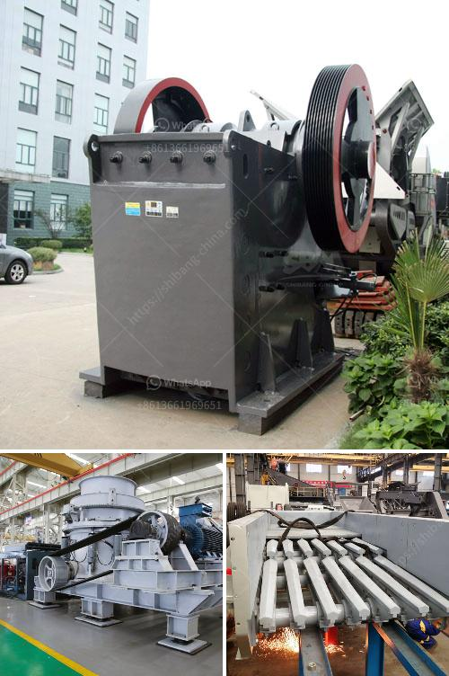

<h3>cone crusher on rent in orissa</h3>
Cone Crusher on Rent in Orissa: Cone crusher is often used as a secondary or tertiary crusher in mines or ore processing plants. It is a highly efficient crushing machine that can produce high-quality materials at a relatively lower cost.

Cone crushers are popular rock crushing machines in aggregates production, mining operations, and recycling applications. They are normally used in secondary, tertiary, and quaternary crushing stages. However, in cases where the feed size of the material is small enough to be handled by a primary crusher, cone crushers can also be used as primary crushers.

The cone crusher works by breaking rocks into small pieces. Once the rocks are broken down, they will be passed through the mantle and concave, which are the main crushing surfaces. These surfaces are responsible for reducing the size of the rocks by compressing them.

One of the key advantages of cone crushers is their ability to crush hard or abrasive materials effectively. Unlike other crushers, such as jaw crushers or impact crushers, cone crushers use compression force to break the rocks. This results in a higher crushing efficiency and better product quality.

Another advantage of cone crushers is their versatility. They can be used in various applications, including mining, construction, and demolition. They are capable of producing a wide range of materials, including aggregates, road base, and asphalt.

Renting a cone crusher in Orissa can be beneficial for a variety of reasons. Perhaps you don't have the necessary equipment or expertise to process the material yourself. Or maybe you want to save costs by renting a crusher instead of purchasing one. Whatever the reason, renting a cone crusher in Orissa is an excellent solution.

When renting a cone crusher in Orissa, you should consider various factors. First, you need to determine the capacity of the crusher that you require. The capacity should be based on the amount of material you need to process per hour.

Next, you should consider the size of the cone crusher. The size will depend on the size of the materials you need to crush and the desired output size. It is essential to choose a cone crusher that can handle the size and type of material you are working with.

Additionally, you should consider the maintenance and operating costs associated with renting a cone crusher. Make sure you understand the rental terms, including any additional charges for maintenance, repairs, or fuel. It is crucial to assess the total cost of renting a cone crusher to ensure it fits within your budget.

Renting a cone crusher in Orissa can provide several benefits, including cost savings, improved efficiency, and reduced downtime. Whether you need to process aggregates for construction projects or crush ore for mining operations, a cone crusher can be a valuable asset.

In conclusion, a cone crusher is a versatile and efficient crushing machine that is commonly used in various applications. Renting a cone crusher in Orissa can be a cost-effective solution for processing materials and achieving high-quality product output. Make sure to consider the crusher's capacity, size, and maintenance costs when renting to ensure it meets your needs and fits within your budget.
<h3>Contact us</h3><ul><li><strong>Whatsapp:&nbsp;<a href="https://wa.me/8613661969651">+8613661969651</a></strong></li><li><a href="https://swt.shibang-china.com/?git&amp;zhl&amp;cone crusher on rent in orissa"><strong>Online Service(chat now)</strong></a></li></ul><h3>Related</h3><ul><li><a href='crusher machine price in nigeria.md'>crusher machine price in nigeria</a></li><li><a href='mobile crusher di malaysia.md'>mobile crusher di malaysia</a></li><li><a href='crusher in ethiopia.md'>crusher in ethiopia</a></li><li><a href='mobile stone crusher price south africa.md'>mobile stone crusher price south africa</a></li><li><a href='costs of calcium carbonate making machinery in japan.md'>costs of calcium carbonate making machinery in japan</a></li></ul>