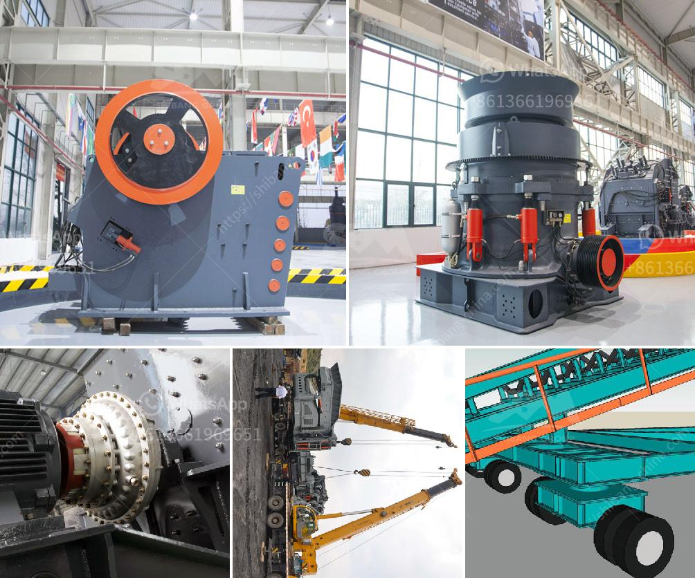

<h3>cone crushers for 3 mm</h3>
Cone crushers are popular rock crushing machines in aggregates production, mining operations, and recycling applications. They are normally used in the secondary, tertiary, and quaternary crushing stages. The new generation of cone crushers offers superior performance and enhances the crushing efficiency.

One of the significant advantages of cone crushers is their ability to produce a wide range of particle sizes. Cone crushers can handle 3mm particle size with ease, making them suitable for various industries and applications that require consistent and specific crushing requirements.

When it comes to crushing 3mm particle size, cone crushers excel in providing a high-quality end product. The advanced design and innovative features of modern cone crushers ensure that the final product has excellent shape and is of high quality. This is crucial for industries such as construction and mining, where the quality of the crushed material directly influences the overall project outcome.

Furthermore, cone crushers are highly efficient in crushing 3mm particle size due to their unique operating principles. Cone crushers work by squeezing the material between an eccentrically rotating mantle and a concave hopper. This process facilitates the crushing action, resulting in a finer product. The closed-side setting (CSS) of the cone crusher can also be adjusted to control the size of the output material, providing flexibility and adaptability to meet specific requirements.

Additionally, cone crushers are known for their robust construction and reliability. They are designed to withstand high loads and operate under challenging conditions, ensuring a longer lifespan and reduced downtime. This is essential for industries that rely heavily on continuous and uninterrupted crushing operations.

In conclusion, cone crushers are an excellent choice for crushing 3mm particle size efficiently and effectively. With their capability to produce a wide range of particle sizes, high-quality crushing output, and durable design, cone crushers are a reliable solution for industries requiring consistent and specific crushing requirements. By investing in cone crushers, businesses can achieve optimal crushing performance, enhance productivity, and reduce operational costs.
<h3>Contact us</h3><ul><li><strong>Whatsapp:&nbsp;<a href="https://wa.me/8613661969651">+8613661969651</a></strong></li><li><a href="https://swt.shibang-china.com/?git&amp;zhl&amp;cone crushers for 3 mm"><strong>Online Service(chat now)</strong></a></li></ul><h3>Related</h3><ul><li><a href='average cost of graphite mining plant.md'>average cost of graphite mining plant</a></li><li><a href='tph stone crusher.md'>tph stone crusher</a></li><li><a href='machinery required for marble quarry crusher.md'>machinery required for marble quarry crusher</a></li><li><a href='stone quarry machine price.md'>stone quarry machine price</a></li><li><a href='dolomite processing plant.md'>dolomite processing plant</a></li></ul>