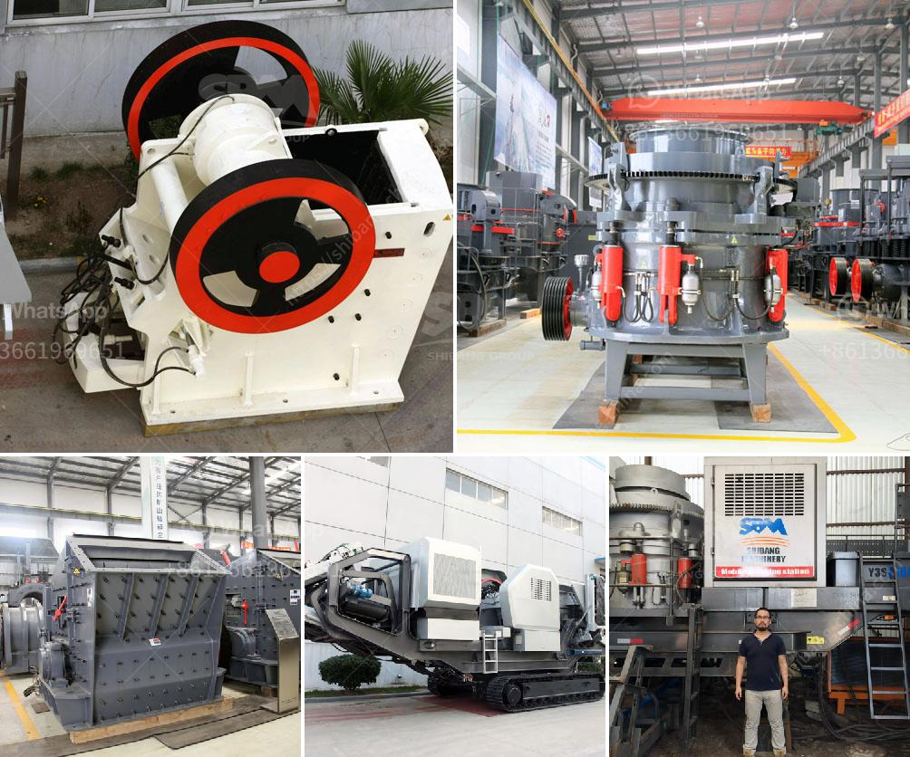

<h3>cone crushers for sale south africa</h3>
Cone crushers are commonly used in the mining and aggregates industry for crushing rock and ores. They are categorized based on the size of the material they can handle and their capacity to process large quantities of material in a short time. Cone crushers for sale South Africa are used for the rapid, gentle crushing and pre-crushing of medium-hard, hard, brittle, and tough materials.

Efficiency, versatility, and durability are key features inherent in cone crushers. These machines can easily be matched to changes in production through the proper selection of crushing chamber and eccentric throw. With their simplified hydraulic circuit, exceptional maneuverability, and compact size, cone crushers are designed to tackle various types of quarrying operations, even those in the most demanding environments.

One of the leading cone crusher manufacturers in South Africa, Metso, provides versatile and reliable equipment that ensures high-quality performance. Their cone crushers are popular among contractors, recycling centers, and mining operations. Metso cone crushers can be used for diverse applications, including secondary and tertiary crushing and the reduction of materials like ores, granite, and basalt.

When considering cone crushers for sale South Africa, it is essential to consider the reputation and experience of the supplier. A reputable supplier with extensive experience in the industry would have a deep understanding of customers' needs and deliver reliable and durable machines.

In conclusion, the availability of cone crushers for sale South Africa is an indicator of the country's growing demand for high-quality, durable machines that offer efficient production. While cone crushers are key pieces of equipment in many industries in South Africa, they are not the only types of crushers in this country. Other types, such as jaw crushers and impact crushers, can also be found on the market, providing an extensive range of options for buyers.
<h3>Contact us</h3><ul><li><strong>Whatsapp:&nbsp;<a href="https://wa.me/8613661969651">+8613661969651</a></strong></li><li><a href="https://swt.shibang-china.com/?git&amp;zhl&amp;cone crushers for sale south africa"><strong>Online Service(chat now)</strong></a></li></ul><h3>Related</h3><ul><li><a href='simple stone crushing machine price in kenya.md'>simple stone crushing machine price in kenya</a></li><li><a href='used vertical grinding machine.md'>used vertical grinding machine</a></li><li><a href='crusher and screening plant.md'>crusher and screening plant</a></li><li><a href='blue metal crusher product machine price coimbatore.md'>blue metal crusher product machine price coimbatore</a></li><li><a href='jaw crusher plant 20 tph.md'>jaw crusher plant 20 tph</a></li></ul>