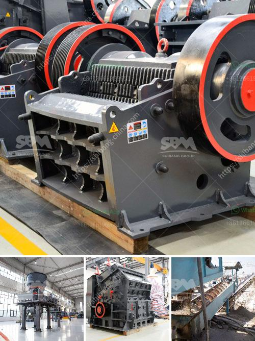

<h3>construction of jaw crusher</h3>
The jaw crusher is a machine used in industries such as mining and construction that helps in reducing large rocks into smaller pieces. There are many factors to consider when purchasing a jaw crusher, including its size, power source, and the material it will be used to process. Jaw crushers are mainly used in primary crushing applications to crush large rocks into smaller rocks and gravel. They can also be used in secondary crushing applications to provide a finer end product size.

The construction of a jaw crusher consists of a set of vertical jaws, one jaw being fixed and the other moving. The innovative design of this machine allows for changeable plates to be easily replaced using bolt-on technology. This ensures the jaw plates are securely in place, preventing the possibility of rocks slipping between them during operation.

One of the main advantages of a jaw crusher is its ability to process hard and abrasive materials. They have a high reduction ratio and a uniform product size distribution, making them suitable for both primary and secondary crushing applications. This machine is ideal for processing materials such as granite, basalt, limestone, and river gravel.

The jaw crusher is powered by an electric motor or a diesel engine, making it easy to use in remote areas or where power is limited. As the machine is being fed, the material travels down between the two jaws, breaking it into smaller pieces. The crushed material then exits through the bottom of the machine, making it suitable for further processing.

In conclusion, the construction of a jaw crusher plays a vital role in its durability and operational efficiency. Its ability to crush hard and abrasive materials, along with its easy maintenance and power source versatility, make it a valuable asset in the mining and construction industries. When considering a jaw crusher for purchase, it is crucial to evaluate factors such as its size, power source, and the material it will be used to process.
<h3>Contact us</h3><ul><li><strong>Whatsapp:&nbsp;<a href="https://wa.me/8613661969651">+8613661969651</a></strong></li><li><a href="https://swt.shibang-china.com/?git&amp;zhl&amp;construction of jaw crusher"><strong>Online Service(chat now)</strong></a></li></ul><h3>Related</h3><ul><li><a href='ultra fine grinding mill price.md'>ultra fine grinding mill price</a></li><li><a href='stone crusher and quarry plant in jordan.md'>stone crusher and quarry plant in jordan</a></li><li><a href='price of a stone crusher machine in zambia.md'>price of a stone crusher machine in zambia</a></li><li><a href='brick making machines for sale in zimbabwe.md'>brick making machines for sale in zimbabwe</a></li><li><a href='cement mill manufacturers in italy.md'>cement mill manufacturers in italy</a></li></ul>