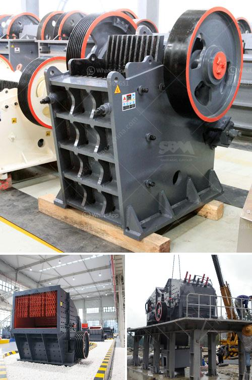

<h3>continuous ball mill for sale in malaysia</h3>
Continuous ball mill is the key equipment for grinding materials after they are crushed. It is widely used in cement, silicate products, new building materials, refractories, fertilizers, black and non-ferrous metal processing, glass ceramics, and other production industries. It can carry out both wet and dry grinding operations and can be operated continuously for a long time.

In Malaysia, the continuous ball mill for sale is widely used in various industries such as cement, silicate products, new building materials, refractories, fertilizers, black and non-ferrous metal processing, glass ceramics, and chemical industries. It can achieve a wide range of applications with a wide range of outputs and good adaptability to various materials.

The continuous ball mill for sale has a larger diameter and length compared with the batch ball mill, which increases the grinding efficiency and reduces the energy consumption. The continuous ball mill can grind harder materials, such as stones, ores, and other materials that are not easily ground in batch ball mills. In addition, the continuous ball mill can grind different types of materials with different hardness and particle size, which improves the grinding effect and reduces the particle size of the material.

One of the advantages of the continuous ball mill for sale is that it can be used for both wet and dry grinding processes. With the wet grinding process, the material is mixed with water or other liquids to form a slurry and then conveyed to the grinding chamber to achieve the desired particle size. With the dry grinding process, the material is fed into the grinding chamber without any liquid and the grinding media is in contact with the material to achieve the desired particle size.

The continuous ball mill for sale in Malaysia has the characteristics of compact structure, reliable operation, low failure rate, and low production cost. The lining plate in the barrel can be replaced, which significantly improves the wear resistance of the barrel and prolongs the service life of the equipment. In addition, the continuous ball mill for sale adopts a uniform discharge system, which is beneficial to improve the grinding efficiency and reduce the over-grinding phenomenon.

In summary, the continuous ball mill for sale in Malaysia is an essential equipment in the industrial production process. It has a wide range of applications, strong adaptability to materials, and high grinding efficiency. It is widely used in cement, silicate products, new building materials, refractories, fertilizers, black and non-ferrous metal processing, glass ceramics, and other industries. With its reliable performance, low failure rate, and low production cost, the continuous ball mill is favored by customers and has a broad market prospect in Malaysia.
<h3>Contact us</h3><ul><li><strong>Whatsapp:&nbsp;<a href="https://wa.me/8613661969651">+8613661969651</a></strong></li><li><a href="https://swt.shibang-china.com/?git&amp;zhl&amp;continuous ball mill for sale in malaysia"><strong>Online Service(chat now)</strong></a></li></ul><h3>Related</h3><ul><li><a href='small diesel engine jaw crusher.md'>small diesel engine jaw crusher</a></li><li><a href='gold processing mill for sale.md'>gold processing mill for sale</a></li><li><a href='hammer mill suppliers in kenya.md'>hammer mill suppliers in kenya</a></li><li><a href='stone gravel crusher price at ranchi.md'>stone gravel crusher price at ranchi</a></li><li><a href='rotary thermal dryer mining.md'>rotary thermal dryer mining</a></li></ul>