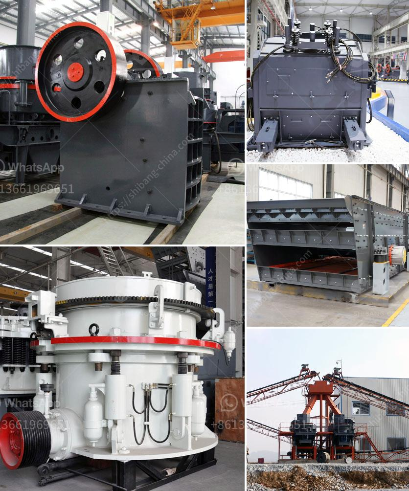

<h3>convaer belting company in durban</h3>
When it comes to industries that require the movement of heavy materials, the role of conveyor belts cannot be underestimated. Whether it's in mining, manufacturing, or logistics, conveyor belts play a crucial role in ensuring the smooth and efficient flow of goods and materials. As one of the leading conveyor belting companies in Durban, the company XYZ has been revolutionizing the industry with its exceptional products and services.

Established in Durban over a decade ago, XYZ has earned a reputation for its superior conveyor belting solutions. With a focus on providing high-quality products, innovative technologies, and exceptional customer service, XYZ has become the go-to company for many businesses in the region.

One of the key factors that set XYZ apart from its competitors is its extensive range of conveyor belts. The company offers a wide variety of options, including fabric conveyor belts, steel cord conveyor belts, PVC conveyor belts, and more. What makes these belts stand out is their durability, strength, and resistance to wear and tear. XYZ understands the demanding nature of industries, and they ensure that their belts can withstand even the harshest conditions, delivering uninterrupted performance.

XYZ also takes pride in its technological advancements. Keeping up with the rapidly evolving industry, the company has integrated state-of-the-art technology into its products. These advancements include advanced tracking systems, remote monitoring capabilities, and automated maintenance features. With these innovations, businesses can experience increased efficiency, reduced downtime, and improved overall productivity.

Moreover, XYZ offers tailored conveyor belting solutions to meet specific customer requirements. The company understands that every industry has unique needs, and a one-size-fits-all approach simply doesn't apply. Whether it's a short-distance warehouse conveyor or a long-distance mining operation, XYZ has the expertise to design, install, and maintain a conveyor system that suits the specific needs of each individual client.

In addition to their exceptional product range, XYZ is known for its outstanding customer service. The company takes a customer-centric approach, ensuring that each client receives personalized attention and support. From the initial consultation to ongoing maintenance and support, XYZ goes above and beyond to ensure customer satisfaction. Their knowledgeable and experienced team is always ready to assist, whether it is providing guidance on product selection or addressing any concerns or issues that may arise.

Furthermore, XYZ prioritizes sustainability and environmental responsibility. They strive to minimize their ecological footprint by using eco-friendly materials and implementing energy-efficient production processes. By choosing XYZ as their conveyor belting provider, businesses can align themselves with an environmentally conscious company and contribute to a greener future.

In conclusion, XYZ is a leading conveyor belting company in Durban that continues to set the standard in the industry. With their vast range of high-quality products, cutting-edge technology, tailored solutions, exceptional customer service, and commitment to sustainability, XYZ is the ideal partner for businesses looking to optimize their material handling operations. Whether it's improving efficiency, reducing downtime, or enhancing overall productivity, XYZ has proven time and again that they have the expertise and resources to deliver reliable and efficient conveyor belting solutions for any industry.
<h3>Contact us</h3><ul><li><strong>Whatsapp:&nbsp;<a href="https://wa.me/8613661969651">+8613661969651</a></strong></li><li><a href="https://swt.shibang-china.com/?git&amp;zhl&amp;convaer belting company in durban"><strong>Online Service(chat now)</strong></a></li></ul><h3>Related</h3><ul><li><a href='automatic feeder for ball mill customer case.md'>automatic feeder for ball mill customer case</a></li><li><a href='price list stone crusher machine guangzhou.md'>price list stone crusher machine guangzhou</a></li><li><a href='quartz stone crusher application.md'>quartz stone crusher application</a></li><li><a href='indonesia hammer mill for sale.md'>indonesia hammer mill for sale</a></li><li><a href='component of jaw crusher.md'>component of jaw crusher</a></li></ul>