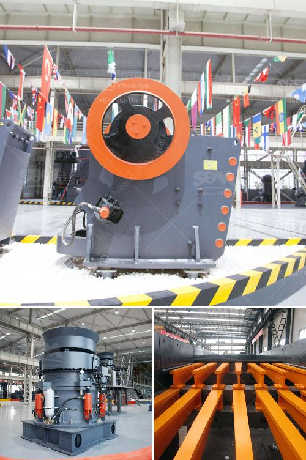

<h3>conventional hammer mill</h3>
The conventional hammer mill is a device that has been used for years in the agricultural, construction, and manufacturing industries. It is designed to crush and grind various types of solid materials into small particles.

One of the main advantages of the conventional hammer mill is its versatility. It can be used for a wide range of applications, including crushing, grinding, and pulverizing materials such as grains, wood chips, and biomass. The mill operates by feeding the material into a chamber where a series of rotating hammers strike the material, causing it to break apart into smaller pieces.

Another advantage of the conventional hammer mill is its efficiency. The hammers are designed to deliver a high impact force, which results in more efficient crushing and grinding. This makes the mill ideal for processing large amounts of material in a short period of time.

In addition to its efficiency, the conventional hammer mill is also known for its durability. The hammers are made from high-quality steel, which ensures that they can withstand the rigorous demands of continuous use. The mill is also equipped with a heavy-duty motor and a strong frame, which further contribute to its long lifespan.

Furthermore, the conventional hammer mill is relatively easy to maintain. The hammers can be easily replaced when they become worn out, and regular cleaning and lubrication are all that is needed to keep the mill running smoothly. This makes it a cost-effective solution for businesses and industries that require a reliable and low-maintenance crushing and grinding machine.

Despite its many advantages, the conventional hammer mill does have some limitations. For instance, it may not be suitable for processing materials that are extremely hard or abrasive. In such cases, a different type of crusher or grinder may be more appropriate.

In recent years, there have been advancements in the design and technology of hammer mills. Some manufacturers have developed more advanced models that offer improved performance and efficiency compared to the traditional hammer mill. These newer models may include features such as increased power and speed, enhanced safety measures, and improved control systems.

In conclusion, the conventional hammer mill is a versatile and efficient machine that has been widely used in various industries for many years. Its ability to crush, grind, and pulverize solid materials makes it a valuable tool for businesses and industries that require size reduction. Although it has limitations, the conventional hammer mill remains a popular choice due to its reliability, durability, and cost-effectiveness.
<h3>Contact us</h3><ul><li><strong>Whatsapp:&nbsp;<a href="https://wa.me/8613661969651">+8613661969651</a></strong></li><li><a href="https://swt.shibang-china.com/?git&amp;zhl&amp;conventional hammer mill"><strong>Online Service(chat now)</strong></a></li></ul><h3>Related</h3><ul><li><a href='dealers and manufacturers crusher in europe.md'>dealers and manufacturers crusher in europe</a></li><li><a href='crushed price impact crusher price.md'>crushed price impact crusher price</a></li><li><a href='cost of vertical roller mill.md'>cost of vertical roller mill</a></li><li><a href='gold ore crushers for sale in india.md'>gold ore crushers for sale in india</a></li><li><a href='medium sized stone crusher for sale.md'>medium sized stone crusher for sale</a></li></ul>