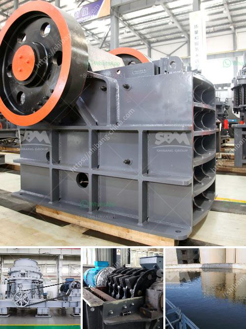

<h3>conveyor belt consultants</h3>
In a world where efficiency is paramount for businesses across industries, every aspect of operations needs to be optimized. One crucial element that plays a significant role in various industries is the conveyor belt system. From manufacturing and distribution to mining and agriculture, conveyor belts ensure seamless movement of materials, products, and resources. This is where conveyor belt consultants come into the picture, offering expertise and guidance to streamline operations and enhance efficiency.

Conveyor belt consultants are professionals with extensive knowledge and experience in conveyor belt systems. They provide valuable insights and assistance in designing, installing, and maintaining conveyor belt systems that align with specific business requirements. Their expertise goes beyond simply selecting the right type of conveyor belt, as they delve deep into understanding the unique needs of each industry and finding customized solutions to achieve operational excellence.

One of the key roles of conveyor belt consultants is to assess the existing system or layout and identify areas for improvement. They thoroughly analyze the flow of materials and products, looking for bottlenecks, inefficiencies, and safety concerns. By spotting these areas, consultants can propose innovative solutions to optimize the conveyor belt system and increase productivity.

Moreover, conveyor belt consultants act as valuable partners during the selection and installation process of new conveyor belt systems. They assist in evaluating different types of belts, considering factors such as material composition, strength, wear resistance, and environmental conditions. With their expertise, consultants can help businesses select the most suitable conveyors, minimizing the risk of malfunctions, breakdowns, and costly repairs in the long run.

Once the system is up and running, conveyor belt consultants continue to play an integral role in ensuring its smooth operation. They offer preventative maintenance plans that include regular inspections, lubrication, and adjustments to keep the conveyor belt system running at optimal levels. By catching potential issues early on, consultants help prevent unexpected breakdowns and minimize downtime, saving businesses both time and money.

Furthermore, conveyor belt consultants assist in promoting a culture of safety in workplaces utilizing conveyor belt systems. They conduct safety audits to identify potential hazards and make recommendations to mitigate risks. By implementing safety protocols and providing training to employees, consultants ensure that businesses meet safety regulations, protect their workforce, and reduce the likelihood of workplace accidents.

In summary, conveyor belt consultants are instrumental in enhancing efficiency and productivity for businesses relying on conveyor belt systems. Whether it’s assessing existing systems, selecting and installing new equipment, or providing essential maintenance and safety support, their expertise helps optimize operations, reduce downtime, and improve the bottom line. By partnering with conveyor belt consultants, businesses gain a competitive edge and ensure their conveyor belt systems are designed to meet the unique requirements of their industry. With their guidance, the seamless movement of materials becomes a reality, allowing businesses to focus on what they do best – driving growth and success.
<h3>Contact us</h3><ul><li><strong>Whatsapp:&nbsp;<a href="https://wa.me/8613661969651">+8613661969651</a></strong></li><li><a href="https://swt.shibang-china.com/?git&amp;zhl&amp;conveyor belt consultants"><strong>Online Service(chat now)</strong></a></li></ul><h3>Related</h3><ul><li><a href='hammer grinder machine price.md'>hammer grinder machine price</a></li><li><a href='100tph stone crusher.md'>100tph stone crusher</a></li><li><a href='price stone crusher.md'>price stone crusher</a></li><li><a href='crushers plant price.md'>crushers plant price</a></li><li><a href='hammer mill bison price.md'>hammer mill bison price</a></li></ul>