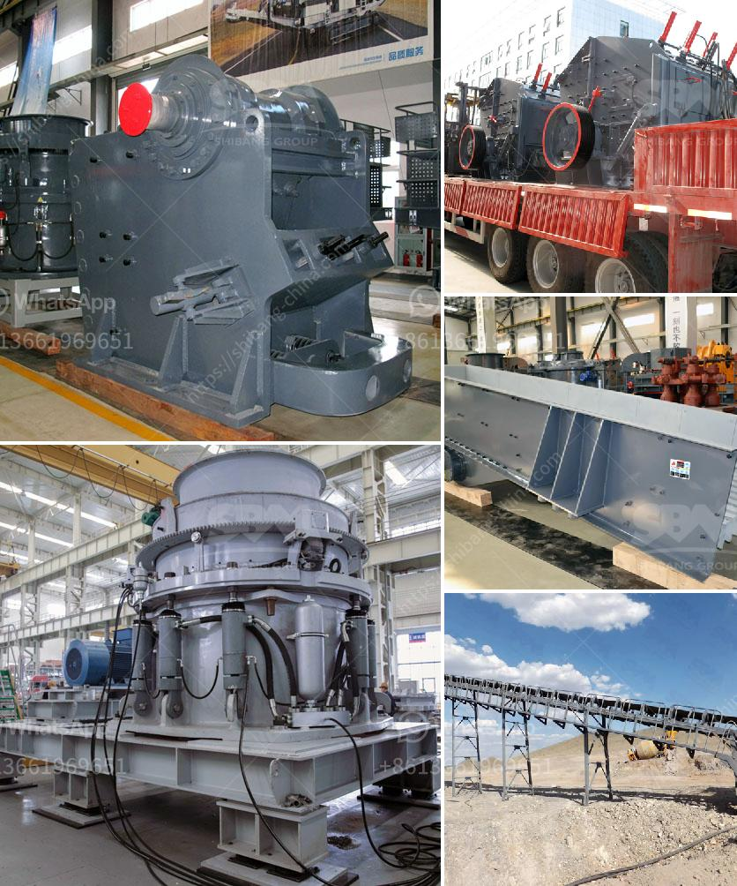

<h3>conveyor belt manufacturer in china</h3>
China is the world’s largest producer and consumer of conveyor belts. With their vast manufacturing capacity and high-quality standards, Chinese companies have made a name for themselves in the domestic as well as the international market. As a leading conveyor belt manufacturer, China has a strong foothold in various industries, including mining, manufacturing, transportation, and logistics. In this article, we will explore the reasons why Chinese conveyor belt manufacturers are excelling in the global market.

First and foremost, Chinese conveyor belt manufacturers have a competitive advantage in terms of production capacity. These manufacturers benefit from China's well-established industrial infrastructure, which includes advanced machinery and skilled labor. They have the capability to produce conveyor belts in large quantities without compromising on quality. The sheer scale of their production allows them to meet the high demand from both domestic and international markets.

Moreover, Chinese conveyor belt manufacturers are known for their commitment to quality. They adhere to strict quality control measures throughout the manufacturing process, ensuring that each belt meets industry standards. This attention to detail has earned them a reputation for producing reliable and durable conveyor belts that can withstand heavy loads and harsh working environments.

In addition to production capacity and quality, Chinese manufacturers are also renowned for their innovative solutions. They invest heavily in research and development to stay ahead of the curve and meet the evolving needs of the market. By constantly improving their product designs and incorporating new technologies, they are able to offer conveyor belts that are not only efficient but also cost-effective. This focus on innovation has played a crucial role in their success, as it allows them to cater to a wide range of industries and applications.

Furthermore, Chinese conveyor belt manufacturers prioritize customer satisfaction. They provide excellent customer service, offering technical support and after-sales assistance to their clients. Their commitment to building long-term relationships with customers has earned them a loyal client base, both in China and abroad. This customer-centric approach sets them apart from their competitors and helps them maintain a strong market presence.

China's conveyor belt manufacturers are also gaining a competitive edge by focusing on sustainability. They are increasingly adopting eco-friendly practices, such as using recyclable materials and reducing energy consumption during production. This commitment to sustainability resonates with customers who prioritize environmentally-friendly solutions. By aligning themselves with global trends towards sustainability, Chinese manufacturers are able to attract international buyers and expand their market share.

In conclusion, China's conveyor belt manufacturers have emerged as global leaders due to their production capacity, commitment to quality, innovation, customer-centric approach, and sustainability efforts. With their ability to produce high-quality conveyor belts in large quantities, these manufacturers have become trusted partners for industries worldwide. As they continue to invest in research and development and adapt to changing market demands, Chinese conveyor belt manufacturers are expected to maintain their dominant position in the global market.
<h3>Contact us</h3><ul><li><strong>Whatsapp:&nbsp;<a href="https://wa.me/8613661969651">+8613661969651</a></strong></li><li><a href="https://swt.shibang-china.com/?git&amp;zhl&amp;conveyor belt manufacturer in china"><strong>Online Service(chat now)</strong></a></li></ul><h3>Related</h3><ul><li><a href='jaw crusher for sale in malaysia.md'>jaw crusher for sale in malaysia</a></li><li><a href='sand vsi crusher.md'>sand vsi crusher</a></li><li><a href='manufacturers small concrete brokmachine bangkok.md'>manufacturers small concrete brokmachine bangkok</a></li><li><a href='150 tpd cement line price.md'>150 tpd cement line price</a></li><li><a href='marble stone powder manufacturer in pakistan.md'>marble stone powder manufacturer in pakistan</a></li></ul>