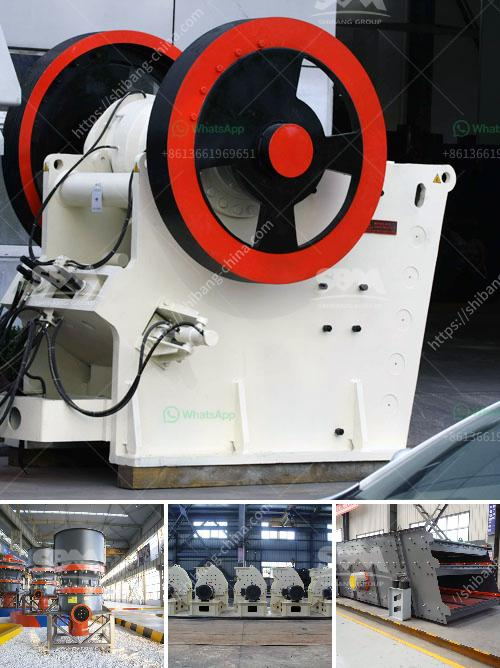

<h3>conveyor belt manufacturers bangladesh</h3>
Conveyor belts are an essential component in numerous industries, including manufacturing, food processing, logistics, and more. They facilitate the movement of materials from one location to another, streamlining processes and enhancing overall efficiency and productivity. In Bangladesh, the demand for conveyor belts has been increasing steadily, leading to the rise of conveyor belt manufacturers in the country.

One prominent player in the industry is Bangladesh Conveyor Belt Ltd. This company has emerged as a leading conveyor belt manufacturer in Bangladesh, expanding its presence not only domestically but also globally. With a commitment to producing high-quality products, Bangladesh Conveyor Belt Ltd has gained a competitive advantage in the market.

One of the key factors contributing to the success of Bangladesh Conveyor Belt Ltd is its technologically advanced manufacturing facilities. The company utilizes state-of-the-art machinery and equipment to ensure the production of top-notch conveyor belts. These modern facilities enable the company to meet the growing demand for conveyor belts in Bangladesh and overseas.

Moreover, Bangladesh Conveyor Belt Ltd focuses on continuous research and development to improve the quality and performance of its products. By investing in innovation, the company enhances its competitiveness and positions itself as a reliable manufacturer. This commitment to continuous improvement has earned Bangladesh Conveyor Belt Ltd a reputation for providing durable and reliable conveyor belts.

In addition to manufacturing, Bangladesh Conveyor Belt Ltd also places significant emphasis on customer satisfaction. The company prioritizes understanding the specific needs and requirements of its clients and strives to deliver tailor-made solutions. This customer-centric approach has fostered strong relationships with clients and has played a crucial role in the company's growth and success in Bangladesh's conveyor belt market.

Another notable conveyor belt manufacturer in Bangladesh is Multiconveyor International. With a vast range of conveyor belt solutions, Multiconveyor International serves various industries, including textiles, packaging, cement, steel, and more. The company offers both standard and customized conveyor belts to meet the diverse needs of its clients.

Multiconveyor International prides itself on its adherence to international quality standards. The company utilizes high-quality raw materials to ensure the longevity and performance of its products. Additionally, Multiconveyor International focuses on continuous training and skill development of its workforce to maintain high standards of production.

Furthermore, Multiconveyor International places an emphasis on sustainability. The company recognizes the importance of environmental stewardship and strives to reduce its carbon footprint. By implementing eco-friendly manufacturing processes and using energy-efficient machinery, Multiconveyor International contributes to the sustainability and responsible growth of Bangladesh's conveyor belt industry.

Overall, the growth of conveyor belt manufacturers in Bangladesh reflects the increasing demand for efficient material handling solutions in various sectors. Companies like Bangladesh Conveyor Belt Ltd and Multiconveyor International play a pivotal role in providing reliable and high-quality conveyor belts. Through their commitment to technological advancements, customer satisfaction, and sustainability, these manufacturers contribute to enhancing overall efficiency and productivity in industries in Bangladesh and beyond.
<h3>Contact us</h3><ul><li><strong>Whatsapp:&nbsp;<a href="https://wa.me/8613661969651">+8613661969651</a></strong></li><li><a href="https://swt.shibang-china.com/?git&amp;zhl&amp;conveyor belt manufacturers bangladesh"><strong>Online Service(chat now)</strong></a></li></ul><h3>Related</h3><ul><li><a href='typical particle size of roll crusher.md'>typical particle size of roll crusher</a></li><li><a href='large scale gold mining equipment for sale.md'>large scale gold mining equipment for sale</a></li><li><a href='graphite mining india.md'>graphite mining india</a></li><li><a href='barit mineral processing and extractive malaysia.md'>barit mineral processing and extractive malaysia</a></li><li><a href='list of concrete products manufacturers in ethiopia.md'>list of concrete products manufacturers in ethiopia</a></li></ul>