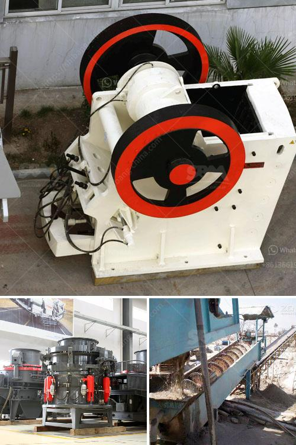

<h3>conveyor belt manufacturers in africa</h3>
Africa is a known hub for providing conveyor belt solutions to various industries all around the continent. Conveyor belt manufacturers in Africa are thriving due to the high demand for conveyor belting systems in the most vibrant sectors of the continent, such as agriculture, mining, food processing, and logistics.

One of the major players in the African conveyor belt market is the South African Conveyor Belt Manufacturers Association (SACBMA). This association acts as a platform for conveyor belt manufacturers in South Africa to collaborate and develop technological advancements to meet the industry's ever-growing demands. SACBMA also plays a vital role in promoting industry standards and best practices to ensure quality and safety for conveyor belt users.

The agricultural sector in Africa is undergoing rapid transformation, with a growing emphasis on mechanization and efficient handling of crops. This has fueled the demand for conveyor belts in agribusiness, particularly in countries like Nigeria, Ethiopia, and Kenya, where large-scale farming and export-oriented crops are prevalent. Conveyor belts in this sector are used for transporting bulk commodities such as grains, fruits, and vegetables, reducing manual labor and increasing efficiency.

Mining is another significant industry in Africa, and conveyor belts play a crucial role in facilitating the transportation of minerals and other resources. South Africa, being one of the leading mining economies in Africa, has a high demand for conveyor belts used in underground and surface mining operations. Manufacturers in the country are constantly innovating to develop conveyor belts that can withstand the harsh conditions in mines while ensuring safe and reliable transportation of materials.

Food processing is yet another sector where conveyor belts are extensively used. From sorting and grading to conveying and packaging, conveyor belts have become an integral part of the food processing industry in Africa. Manufacturers in this segment focus on developing hygienic and durable belts that comply with international food safety standards. With a rapidly growing population and increasing urbanization, the demand for processed and packaged food is on the rise, further driving the need for conveyor belt solutions.

Logistics and transportation are also important sectors in Africa's conveyor belt market. Efficient and reliable conveyor systems are essential for handling goods in warehouses, distribution centers, airports, and ports. Conveyor belts are used for loading and unloading cargo and to connect different areas of a facility, optimizing workflow and reducing manual labor. African manufacturers in this segment focus on developing conveyor belts that can withstand heavy loads and ensure seamless movement of goods.

One of the challenges faced by conveyor belt manufacturers in Africa is competition from international players who offer cheaper alternatives. However, African manufacturers are countering this by focusing on quality, after-sales service, and customization. They leverage their knowledge of local requirements and collaborate with industry partners to develop solutions tailored to the specific needs of African industries. 

Conveyor belt manufacturers in Africa are poised for further growth as the continent continues to witness industrialization and economic development. Continuous innovation, quality manufacturing, and a proactive approach to customer needs will enable them to make significant contributions to Africa's growing industrial landscape.
<h3>Contact us</h3><ul><li><strong>Whatsapp:&nbsp;<a href="https://wa.me/8613661969651">+8613661969651</a></strong></li><li><a href="https://swt.shibang-china.com/?git&amp;zhl&amp;conveyor belt manufacturers in africa"><strong>Online Service(chat now)</strong></a></li></ul><h3>Related</h3><ul><li><a href='vertical mill machine in cement industry.md'>vertical mill machine in cement industry</a></li><li><a href='china jaw crusher importer in pakistan.md'>china jaw crusher importer in pakistan</a></li><li><a href='price crusher price bolivia.md'>price crusher price bolivia</a></li><li><a href='distributor philippines test sieve retsch.md'>distributor philippines test sieve retsch</a></li><li><a href='small grinding mill machine in india.md'>small grinding mill machine in india</a></li></ul>