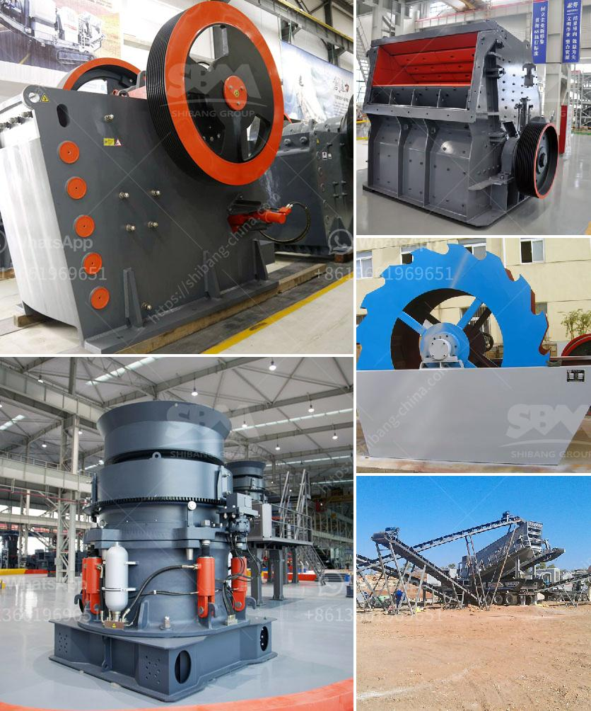

<h3>conveyor belt manufacturing plant crushers equipment</h3>
In any manufacturing plant, crushers are an essential piece of equipment that helps in breaking down raw materials into smaller components to be further processed for various applications. Conveyor belt manufacturing plants rely heavily on crushers to help in efficient functioning of their operations.

Conveyor belts used in manufacturing plants are generally made of layers of rubber and fabric that are bonded together. These belts carry large quantities of raw materials and finished products over long distances, ensuring smooth operations within the plant.

Crushers in a manufacturing plant play a vital role in breaking down raw materials such as rocks, stones, and minerals into smaller fragments. These smaller fragments are then used as feedstock for further processing, or they can be directly utilized in the manufacturing process. It is crucial to choose the right type of crusher that suits the specific requirements of the manufacturing plant.

There are various types of crushers available in the market that cater to different manufacturing needs. Some commonly used crushers in manufacturing plants include jaw crushers, cone crushers, impact crushers, and roll crushers.

Jaw crushers are a popular choice in manufacturing plants as they can efficiently break down materials into smaller sizes. These crushers consist of a fixed jaw and a movable jaw that move in a reciprocating motion. The materials are fed into the jaw crusher through a vibrating feeder and are crushed between the jaws.

Cone crushers are another commonly used type of crusher in manufacturing plants. These crushers have a cone-shaped crushing chamber that revolves eccentrically around the central axis. The raw materials are fed into the cone crusher and are crushed between the mantle and the concave.

Impact crushers, as the name suggests, use impact to break down materials. They have a rotor that revolves at high speeds, and when the raw material enters the crushing chamber, it is struck by the hammers on the rotor. This impact crushes the material and allows it to pass through the grates at the bottom, resulting in the desired output size.

Roll crushers are used to crush materials that are relatively soft or friable, such as coal and limestone. Rolls of different diameters are used to achieve the desired size reduction. The materials are fed into the rolls and crushed between them.

Manufacturing plants need reliable and efficient crushers to ensure uninterrupted operations. Regular maintenance and inspection of the crushers are necessary to prevent unexpected breakdowns and downtime. It is crucial to choose crushers that are suitable for the specific application, taking into consideration factors such as feed size, desired output size, and the hardness of the material.

In conclusion, crushers are an indispensable part of a conveyor belt manufacturing plant. They efficiently break down raw materials into smaller fragments, allowing for further processing and utilization. Choosing the right type of crusher, regular maintenance, and inspection are essential for the smooth functioning of a manufacturing plant. With proper care and attention, crushers can greatly contribute to the overall productivity and efficiency of a conveyor belt manufacturing plant.
<h3>Contact us</h3><ul><li><strong>Whatsapp:&nbsp;<a href="https://wa.me/8613661969651">+8613661969651</a></strong></li><li><a href="https://swt.shibang-china.com/?git&amp;zhl&amp;conveyor belt manufacturing plant crushers equipment"><strong>Online Service(chat now)</strong></a></li></ul><h3>Related</h3><ul><li><a href='brick crusher line production.md'>brick crusher line production</a></li><li><a href='quartz powder manufacturers manufacturers in china.md'>quartz powder manufacturers manufacturers in china</a></li><li><a href='calcium carbonate plant contractors.md'>calcium carbonate plant contractors</a></li><li><a href='grinding mill for quartz in india.md'>grinding mill for quartz in india</a></li><li><a href='project report of dolomite powder plant.md'>project report of dolomite powder plant</a></li></ul>