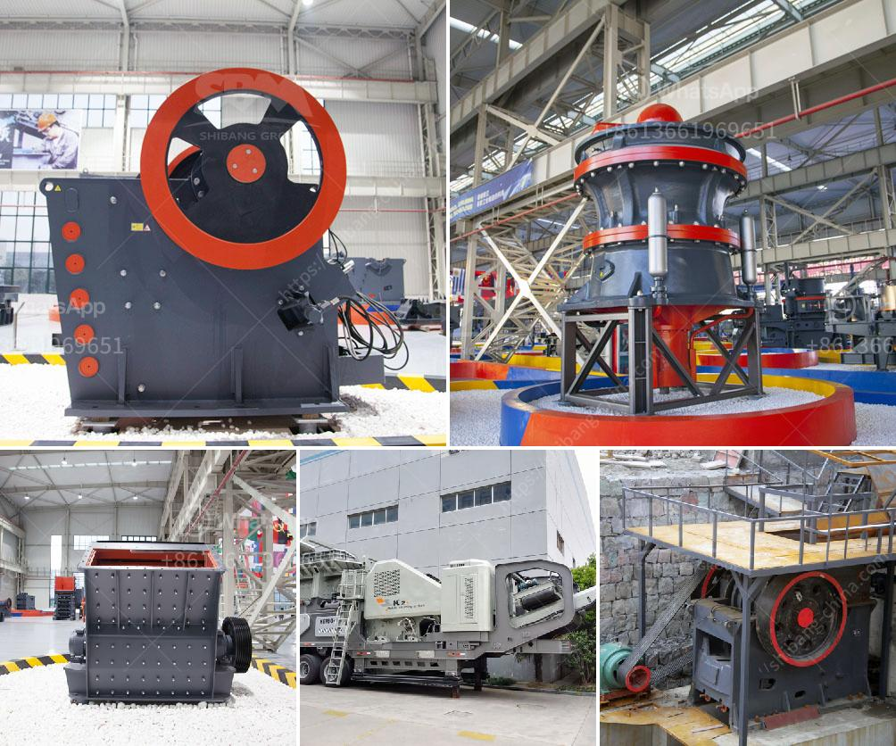

<h3>conveyor belt supplier in shanghai china</h3>
The industrial sector is constantly evolving, demanding innovation in material handling processes to ensure maximum efficiency and productivity. One crucial component in this regard is the conveyor belt, which plays a pivotal role in streamlining the movement of goods and raw materials within factories and warehouses. When it comes to superior conveyor belts, Shanghai, China stands out as a prominent supplier, offering a wide range of high-quality options to meet diverse industrial requirements.

Shanghai, known as the economic powerhouse of China, has established itself as a manufacturing hub for various industries. With its strategic location and robust infrastructure, the city has attracted suppliers and manufacturers from around the globe. As a result, conveyor belt suppliers have flourished in Shanghai, catering to both domestic and international markets.

One notable characteristic of Shanghai's conveyor belt suppliers is their commitment to providing tailored solutions. As industries differ in their needs, these suppliers understand the importance of customization. Whether it is an assembly line in the automotive industry or a packing facility in the food sector, Shanghai offers a comprehensive range of conveyor belts designed to cater to the specific demands of each industry.

The conveyor belt suppliers in Shanghai are renowned for their adherence to international quality standards. They prioritize quality control measures at every stage of the manufacturing process. From the selection of raw materials to the final testing of finished products, these suppliers ensure that their conveyor belts are durable, reliable, and safe. Stringent quality checks guarantee minimal downtime, reducing maintenance costs and maximizing productivity for industrial operations.

In addition to quality, conveyor belt suppliers in Shanghai are also committed to sustainability and environmental responsibility. As the world becomes more conscious of the need for eco-friendly practices, these suppliers incorporate sustainable materials and manufacturing techniques into their conveyor belt production. This results in the development of belts that offer low energy consumption, reduced carbon emissions, and minimal waste generation. By opting for Shanghai's conveyor belt suppliers, industries can align their material handling processes with their sustainability goals.

Moreover, Shanghai's conveyor belt suppliers understand the significance of efficient after-sales service. They prioritize customer satisfaction by providing prompt technical support, routine maintenance, and spare parts availability. This ensures that any issues with the conveyor belts are swiftly addressed, minimizing downtime and maximizing operational efficiency.

Shanghai plays a crucial role in promoting technological advancements in the conveyor belt industry. The city hosts various research and development centers, fostering innovation and continuous improvement. Conveyor belt suppliers in Shanghai collaborate with these institutes to stay at the forefront of technological advancements, incorporating cutting-edge features such as automated control systems and sensors into their belts.

In conclusion, Shanghai, China has emerged as a leading supplier of conveyor belts, offering a comprehensive range of high-quality options tailored to specific industrial needs. Their commitment to quality, sustainability, and efficient after-sales service sets them apart from competitors. By choosing Shanghai's conveyor belt suppliers, industries can enhance their material handling processes, improve operational efficiency, and contribute to a more sustainable future.
<h3>Contact us</h3><ul><li><strong>Whatsapp:&nbsp;<a href="https://wa.me/8613661969651">+8613661969651</a></strong></li><li><a href="https://swt.shibang-china.com/?git&amp;zhl&amp;conveyor belt supplier in shanghai china"><strong>Online Service(chat now)</strong></a></li></ul><h3>Related</h3><ul><li><a href='crushers south africa.md'>crushers south africa</a></li><li><a href='vsi crusher plant.md'>vsi crusher plant</a></li><li><a href='medium sized stone crusher for sale.md'>medium sized stone crusher for sale</a></li><li><a href='gyratory crusher advantages and disadvantages.md'>gyratory crusher advantages and disadvantages</a></li><li><a href='sand washing plant price.md'>sand washing plant price</a></li></ul>