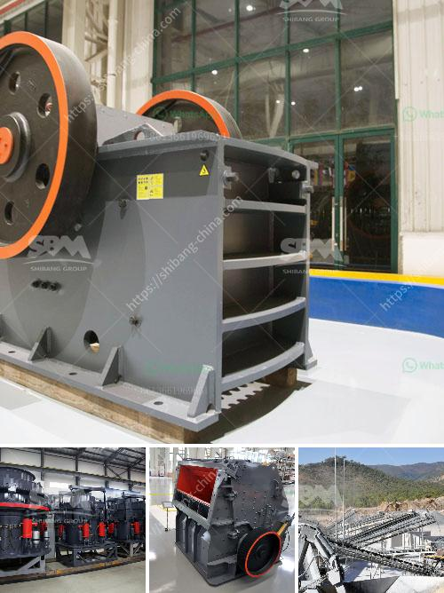

<h3>conveyor belts for sale philippines</h3>
Conveyor belts play a crucial role in various industries, such as food processing, manufacturing, and mining. These mechanical devices help streamline operations by automating the movement of goods and products. In the Philippines, conveyor belts are widely used due to their efficiency and convenience. With a range of options available for sale, businesses can find the perfect conveyor belt solution to suit their specific needs.

One of the primary advantages of conveyor belts is their ability to transport goods and materials over long distances. Unlike manual handling, which is not only time-consuming but also physically demanding, conveyor belts offer a seamless and continuous flow of goods. This enables a more efficient production process leading to increased productivity and reduced labor costs.

Another significant benefit is the improved safety and reduced risks associated with manual handling. Conveyor belts are designed with safety features such as emergency stop buttons, guardrails, and sensors that detect any abnormality in the system, minimizing the chances of accidents or injuries. This is particularly crucial in industries involving heavy loads or hazardous materials, ensuring the well-being of workers and preventing any potential damage to the goods being transported.

Conveyor belts also contribute to better quality control. They allow for precise and consistent positioning of goods, reducing the risk of damage during transportation. Additionally, conveyor belts can be equipped with sorting mechanisms and quality control sensors that can identify and remove defective products from the production line, ensuring that only high-quality items reach the market.

When looking for conveyor belts for sale in the Philippines, businesses have a wide range of options to choose from. Different types of conveyor belts are available, depending on the specific requirements of the industry. For instance, flat belt conveyors are commonly used for transporting lightweight or small-sized products, while roller conveyors are suitable for heavy-duty applications and can handle bulk materials.

Furthermore, conveyor belts can be customized to meet unique specifications. They can be designed to operate in different environments, such as high temperatures, corrosive substances, or areas with limited space. Businesses can also choose between different belt materials, such as rubber, PVC, or metal, ensuring that the conveyor belt matches the requirements of their industry.

When purchasing conveyor belts in the Philippines, it is important to consider the reliability and reputation of the supplier. Working with a reputable supplier ensures the availability of high-quality conveyor belts that meet industry standards. It is also crucial to inquire about after-sales service, including maintenance and repairs, to ensure the longevity of the purchased conveyor belts.

In conclusion, conveyor belts are essential tools for optimizing efficiency in various industries. From improving productivity and safety to enhancing quality control, conveyor belts offer significant advantages over manual handling. With their ability to transport goods over long distances and a wide range of options available for sale in the Philippines, businesses can find the perfect conveyor belt solution to enhance their operations and achieve better results.
<h3>Contact us</h3><ul><li><strong>Whatsapp:&nbsp;<a href="https://wa.me/8613661969651">+8613661969651</a></strong></li><li><a href="https://swt.shibang-china.com/?git&amp;zhl&amp;conveyor belts for sale philippines"><strong>Online Service(chat now)</strong></a></li></ul><h3>Related</h3><ul><li><a href='chrome washing plant for sale south africa.md'>chrome washing plant for sale south africa</a></li><li><a href='track impact crusher.md'>track impact crusher</a></li><li><a href='how to make industrial talcum powder.md'>how to make industrial talcum powder</a></li><li><a href='chrome ore concentrate plant.md'>chrome ore concentrate plant</a></li><li><a href='hammer mill for oregano.md'>hammer mill for oregano</a></li></ul>