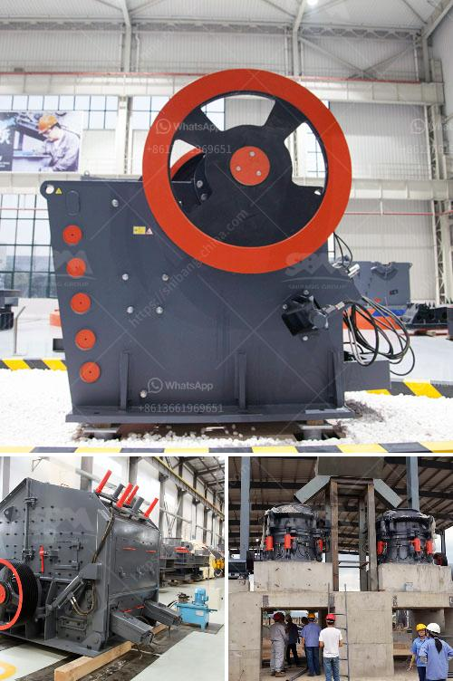

<h3>conveyor belts in coacalco de berriozabal</h3>
Coacalco de Berriozabal, a bustling city located in the State of Mexico, boasts a thriving industrial sector that plays a crucial role in its economy. Among the various industries that power the city's growth, manufacturing takes the lead. And at the heart of every manufacturing process lies a technology that is often overlooked but indispensable – conveyor belts.

Conveyor belts are essentially moving platforms that transport materials and products within a facility or from one location to another. They have revolutionized the manufacturing industry by streamlining production processes, reducing labor costs, and improving overall efficiency. Coacalco de Berriozabal is no exception to this trend and has fully embraced the use of conveyor belts in its manufacturing operations.

One of the key advantages of conveyor belts is their ability to handle heavy loads and bulky items effectively. This capability is particularly useful in Coacalco de Berriozabal's manufacturing sector, which includes various industries such as automotive, textiles, and food processing. In automotive plants, for example, conveyor belts are used to transport heavy components like engines, transmissions, and chassis throughout the assembly line, saving considerable time and effort for workers.

Moreover, conveyor belts enhance the safety of industrial processes in Coacalco de Berriozabal. By automating the movement of materials, the need for manual handling and lifting is minimized, thereby reducing potential injuries and accidents. Workers can now focus on tasks that require their expertise, ultimately improving overall productivity.

In addition to improving safety, conveyor belts also contribute to a cleaner and more hygienic work environment, which is particularly crucial in food processing and pharmaceutical industries. The use of conveyor belts decreases the risk of contamination by eliminating manual handling and reducing the chances of product damage during transport. This not only enhances product quality but also complies with strict regulatory standards, making Coacalco de Berriozabal's manufacturing facilities more attractive to both domestic and international clients.

Furthermore, conveyor belts in Coacalco de Berriozabal are designed to be highly customizable, ensuring that they meet the specific needs of each industry and manufacturing process. They can be configured to operate at varying speeds, transport different types of materials, and be integrated with other machinery such as robotic arms and sorting systems. This versatility allows companies to maximize their operational efficiency and optimize their production lines to meet the ever-growing market demands.

However, it's important to note that the successful implementation of conveyor belts relies heavily on regular maintenance and proper lubrication. Regular inspections, cleaning, and replacement of worn-out components ensure that the conveyor belts perform at their maximum potential, minimizing downtime and preventing costly breakdowns.

In conclusion, conveyor belts have become a vital component of Coacalco de Berriozabal's manufacturing industry, offering numerous benefits such as increased production efficiency, improved worker safety, and compliance with hygiene standards. While their importance may sometimes go unnoticed, conveyor belts play a significant role in streamlining industrial processes and propelling the city's economic growth. With ongoing advancements in conveyor belt technology, Coacalco de Berriozabal can continue to strengthen its position as a leading manufacturing hub in Mexico.
<h3>Contact us</h3><ul><li><strong>Whatsapp:&nbsp;<a href="https://wa.me/8613661969651">+8613661969651</a></strong></li><li><a href="https://swt.shibang-china.com/?git&amp;zhl&amp;conveyor belts in coacalco de berriozabal"><strong>Online Service(chat now)</strong></a></li></ul><h3>Related</h3><ul><li><a href='rock crusher from china.md'>rock crusher from china</a></li><li><a href='second hand stone crushing machines in united kingdom.md'>second hand stone crushing machines in united kingdom</a></li><li><a href='hammer mill equipment south africa price.md'>hammer mill equipment south africa price</a></li><li><a href='big crushing machine.md'>big crushing machine</a></li><li><a href='gold mining equipments manufacturers in denmark.md'>gold mining equipments manufacturers in denmark</a></li></ul>