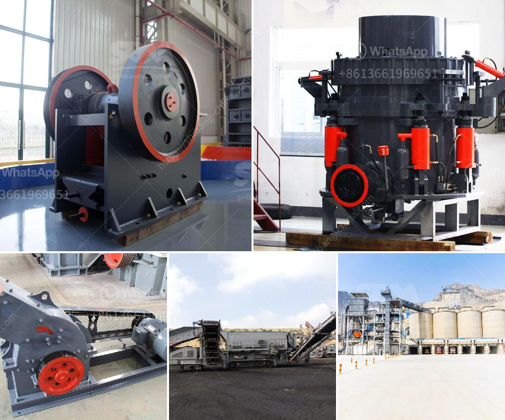

<h3>conveyor belts in france</h3>
Conveyor belts play a crucial role in various industries, enabling the smooth and efficient transportation of goods, materials, and products. The application of conveyor belts is widespread across the globe, and France is no exception. With its advanced infrastructure and booming industrial sector, conveyor belts have become an integral part of the French manufacturing landscape.

France, known for its emphasis on precision, quality, and reliability, has leveraged the use of conveyor belts to streamline production processes, enhance productivity, and minimize overall costs. From automotive factories to food processing facilities, conveyor belts have proven to be a game-changer in ensuring seamless operations across a wide range of industries.

One of the primary benefits of conveyor belts is their ability to automate material handling. By eliminating the need for manual transportation, conveyor belts enable companies to optimize their operations and reduce labor costs significantly. This has allowed French manufacturers to improve their production output while ensuring consistent product quality and reducing the risk of workplace accidents.

In the automotive industry, conveyor belts are indispensable in the assembly line process. Whether it is moving car parts from one workstation to another or facilitating the efficient painting and coating of vehicles, conveyor belts have revolutionized the way cars are manufactured in France. From large-scale manufacturers like Renault and Peugeot to smaller component suppliers, conveyor belts play a pivotal role in ensuring that vehicles are produced with precision and efficiency.

Similarly, in the food and beverage industry, conveyor belts have become a common sight in meat processing plants, dairy factories, and even large supermarkets. With stringent hygiene regulations in place, conveyor belts in France are designed to meet the highest sanitary standards. By efficiently transporting food products, conveyor belts prevent contamination and ensure the freshness and safety of the end products.

Another noteworthy application of conveyor belts in France is within the logistics and warehousing sector. France is known for its efficient supply chain management, and conveyor belts are instrumental in ensuring that the flow of goods remains uninterrupted. In large-scale distribution centers and warehouses, conveyor belts facilitate the movement of packages, reducing manual labor and accelerating order processing times.

Conveyor belts in France are not limited to industrial use only. They have also found their way into retail settings, providing a seamless shopping experience for consumers. From check-out counters to self-service kiosks, conveyor belts assist in the efficient handling of purchases, ensuring a smooth flow of goods and minimizing queues.

As the demand for conveyor belts continues to grow in France, manufacturers are focusing on developing innovative designs and technologies to meet ever-evolving industry requirements. From modular conveyors that can be easily expanded or reconfigured to smart conveyor systems equipped with advanced sensors and automation, French conveyor belt manufacturers are at the forefront of technological advancements in the field.

In conclusion, conveyor belts have become an indispensable part of the French industrial landscape, enabling seamless material handling, enhancing productivity, and ensuring consistent product quality. As France continues to prioritize efficiency and precision in its manufacturing processes, conveyor belts will remain a key component in driving the nation's industry forward.
<h3>Contact us</h3><ul><li><strong>Whatsapp:&nbsp;<a href="https://wa.me/8613661969651">+8613661969651</a></strong></li><li><a href="https://swt.shibang-china.com/?git&amp;zhl&amp;conveyor belts in france"><strong>Online Service(chat now)</strong></a></li></ul><h3>Related</h3><ul><li><a href='gypsum recycling plant.md'>gypsum recycling plant</a></li><li><a href='graphite mining equipment in madagascar suppliers.md'>graphite mining equipment in madagascar suppliers</a></li><li><a href='operation crushing plant.md'>operation crushing plant</a></li><li><a href='grinding mill manufacturers.md'>grinding mill manufacturers</a></li><li><a href='brick making machines for sale in zimbabwe.md'>brick making machines for sale in zimbabwe</a></li></ul>