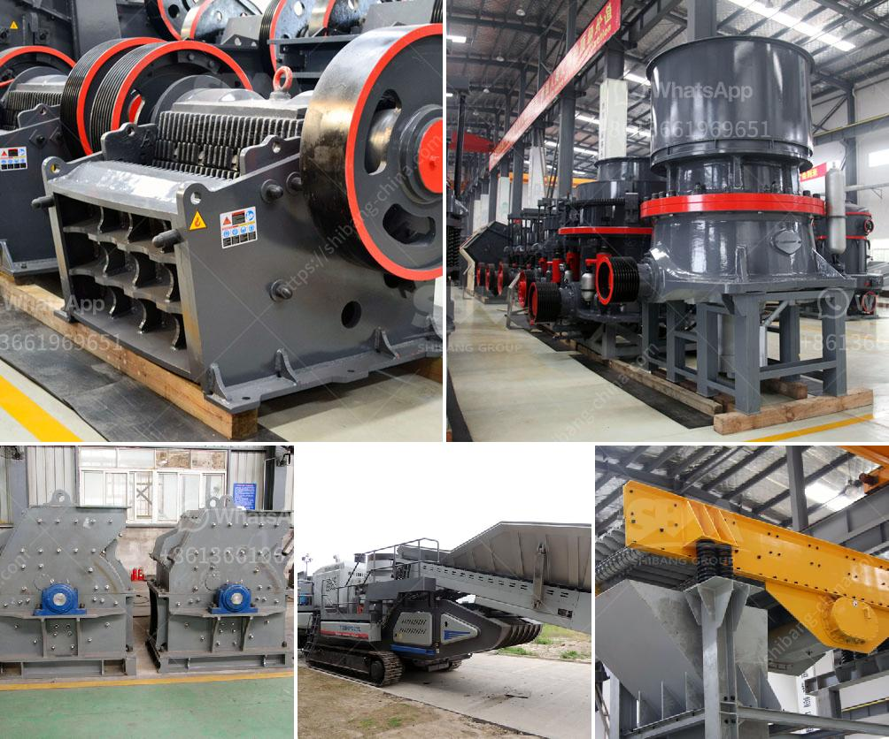

<h3>conveyor belts in the construction</h3>
Conveyor belts have become an integral part of the construction industry, revolutionizing the way materials are transported on construction sites. These sophisticated systems consist of continuous loops of robust materials, such as rubber, fabric, or metal, allowing for the seamless movement of various materials, including debris, gravel, sand, and cement. With their ability to transport bulk items efficiently, conveyor belts have become a valuable asset in improving productivity and streamlining construction processes.

One of the primary advantages of using conveyor belts in construction is the significant time savings they offer. Traditional methods of transporting materials from one location to another, such as manual labor or using wheelbarrows, can be labor-intensive, time-consuming, and prone to accidents. On the other hand, conveyor belts allow for a continuous flow of materials, eliminating the need for manual handling and reducing the number of workers required. This efficient mode of transport ensures a steady supply of materials to different construction areas, saving valuable time and boosting overall productivity.

Conveyor belts also contribute to a safer working environment on construction sites. By minimizing the need for manual labor, workers are exposed to fewer physical strains and the associated risks of injuries. The risk of accidents, such as trips and falls, is greatly reduced as well since conveyor belts operate within a controlled and well-monitored system. With enhanced worker safety, construction projects can progress without unnecessary disruptions or delays.

Additionally, conveyor belts in construction are highly versatile and adaptable. They can be customized to fit various layouts and terrain, allowing materials to be transported efficiently across uneven surfaces, inclines, and even around tight corners. This flexibility ensures that construction projects of different scales and complexities can benefit from the advantages that conveyor belts offer.

In conclusion, conveyor belts have emerged as a time-saving solution in the construction industry. With their ability to transport materials efficiently, they improve productivity, save valuable time, and provide a safer working environment on construction sites. Whether it's moving debris, gravel, or cement, conveyor belts offer a seamless and continuous flow of materials, streamlining construction processes and contributing to the successful completion of projects.
<h3>Contact us</h3><ul><li><strong>Whatsapp:&nbsp;<a href="https://wa.me/8613661969651">+8613661969651</a></strong></li><li><a href="https://swt.shibang-china.com/?git&amp;zhl&amp;conveyor belts in the construction"><strong>Online Service(chat now)</strong></a></li></ul><h3>Related</h3><ul><li><a href='cement plant layout consultants in south kolkata.md'>cement plant layout consultants in south kolkata</a></li><li><a href='small scale electric arc ferrochrome smelting.md'>small scale electric arc ferrochrome smelting</a></li><li><a href='cement clinker grinding unit.md'>cement clinker grinding unit</a></li><li><a href='kaolin crusher processing in japan.md'>kaolin crusher processing in japan</a></li><li><a href='stone crushers price.md'>stone crushers price</a></li></ul>