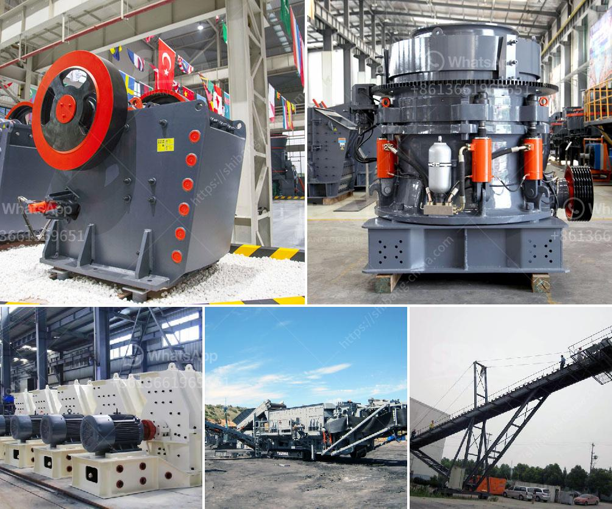

<h3>copper crusher supplier</h3>
Copper is a common material used in a variety of industries, from construction to electronics. While it has many desirable attributes, such as excellent electrical and thermal conductivity, copper is also known for its durability and resistance to corrosion. As a result, it is widely used to manufacture various products, including wires, pipes, and even ammunition.

When it comes to copper crusher suppliers, there are many factors to consider before making a purchase. This guide will help you understand the key points to keep in mind while selecting a reliable supplier.

First and foremost, it is important to ensure that the supplier is reputable and has a proven track record in the industry. One way to evaluate this is by checking the supplier's certifications and accreditations. Reputable suppliers often possess ISO 9001 certification, which indicates that their products and services meet the highest standards of quality. Additionally, look for suppliers who are members of industry associations or have received positive reviews from previous customers.

Next, consider the range of products offered by the supplier. Ideally, they should have a wide selection of copper products to choose from. This includes not only standard copper materials but also specialized products such as copper wires, sheets, bars, and tubes. Having a variety of options allows you to find products that best suit your specific needs.

Another crucial factor to consider is the supplier's manufacturing capabilities. Do they have state-of-the-art facilities and advanced equipment to ensure the quality of their products? Copper manufacturing requires precision and expertise, so it is important to choose a supplier that employs skilled technicians and utilizes the latest technology.

Price is always an important consideration when choosing a supplier. However, it is equally important to remember that quality should not be compromised to save a few extra dollars. Look for suppliers that offer competitive prices without compromising on product quality. Comparing prices from multiple suppliers will help you get an idea of the reasonable market rate and avoid both overcharges and undercharges.

Customer service is another critical aspect to evaluate. A reputable supplier should have a dedicated customer support team that is readily available to assist you with any queries or concerns. Additionally, they should offer fast and efficient delivery services to ensure that you receive your copper products in a timely manner.

Lastly, it is always a good idea to seek recommendations from industry experts or other businesses that have previously worked with the supplier. Their experiences will provide valuable insights into the supplier's reliability, product quality, and customer service.

In conclusion, choosing a copper crusher supplier requires careful consideration of various factors. From reputation and product range to manufacturing capabilities and pricing, each aspect plays a crucial role in ensuring your purchase meets your requirements. By conducting thorough research and evaluating different suppliers, you can find a reliable supplier that offers high-quality copper products at competitive prices.
<h3>Contact us</h3><ul><li><strong>Whatsapp:&nbsp;<a href="https://wa.me/8613661969651">+8613661969651</a></strong></li><li><a href="https://swt.shibang-china.com/?git&amp;zhl&amp;copper crusher supplier"><strong>Online Service(chat now)</strong></a></li></ul><h3>Related</h3><ul><li><a href='fly ash processing plant.md'>fly ash processing plant</a></li><li><a href='crusher plant dolomite.md'>crusher plant dolomite</a></li><li><a href='grinding of limestone mill grinding.md'>grinding of limestone mill grinding</a></li><li><a href='business proposal for stone crushing plant.md'>business proposal for stone crushing plant</a></li><li><a href='hammer mill bolivia.md'>hammer mill bolivia</a></li></ul>