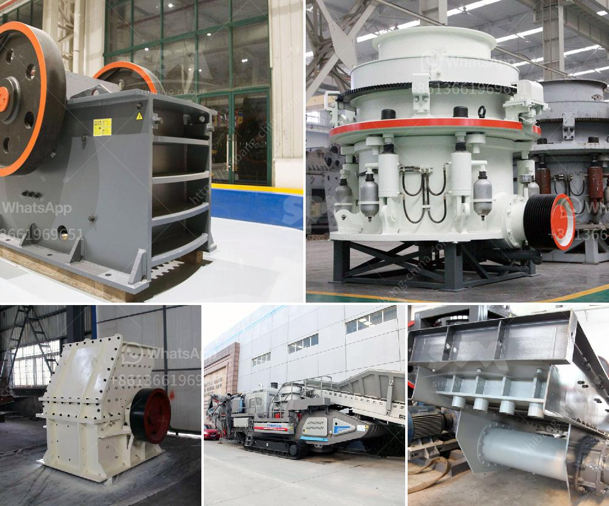

<h3>copper gold crusher separator</h3>
As the mining industry continues to push towards more sustainable and efficient practices, the role of advanced mining equipment becomes increasingly significant. One such innovation is the copper gold crusher separator, an advanced piece of machinery that is revolutionizing the way ores are extracted.

Ore processing involves crushing large rocks into smaller pieces and then separating the valuable minerals from the waste. Traditionally, this task was accomplished through grinding and flotation techniques. However, these methods were time-consuming and energy-intensive, resulting in high operational costs and environmental impacts.

The copper gold crusher separator offers a more efficient and environmentally friendly approach to ore processing. The key to its success lies in its ability to separate valuable minerals from gangue minerals with high precision and speed.

This separator employs a combination of gravity, flotation, and magnetic separation technologies to isolate the valuable minerals efficiently. The process begins with the crushing of ore particles, which are then fed into the separator. Inside, the crushed ore undergoes various mechanical and chemical treatments to enhance its separation.

One of the standout features of the copper gold crusher separator is its ability to separate copper and gold minerals, which are often found together. This creates a streamlined and cost-effective process, eliminating the need for separate extraction techniques.

Moreover, this separator significantly reduces the environmental impact associated with traditional ore processing methods. By incorporating innovative technologies, it minimizes the use of chemicals and energy consumption, resulting in reduced greenhouse gas emissions and water consumption.

In addition to its operational benefits, the copper gold crusher separator also presents economic advantages. Its high processing speed and efficiency translate into increased productivity and reduced production costs, making it an attractive option for mining companies.

Furthermore, with the growing demand for sustainable practices, mining companies that adopt this advanced technology can enhance their reputation and attract investment from environmentally conscious stakeholders.

The development of the copper gold crusher separator marks a new era in ore processing. By combining advanced technologies and sustainable practices, it addresses key challenges facing the mining industry. By optimizing the extraction process, it not only reduces operational costs but also promotes environmental sustainability, making it a game-changer in the field of mining.
<h3>Contact us</h3><ul><li><strong>Whatsapp:&nbsp;<a href="https://wa.me/8613661969651">+8613661969651</a></strong></li><li><a href="https://swt.shibang-china.com/?git&amp;zhl&amp;copper gold crusher separator"><strong>Online Service(chat now)</strong></a></li></ul><h3>Related</h3><ul><li><a href='equipment used in quarry crusher.md'>equipment used in quarry crusher</a></li><li><a href='items for conveyor belts.md'>items for conveyor belts</a></li><li><a href='manufacturers of stone crushers in usa.md'>manufacturers of stone crushers in usa</a></li><li><a href='portland cement processing units.md'>portland cement processing units</a></li><li><a href='iron ore crusher cost.md'>iron ore crusher cost</a></li></ul>