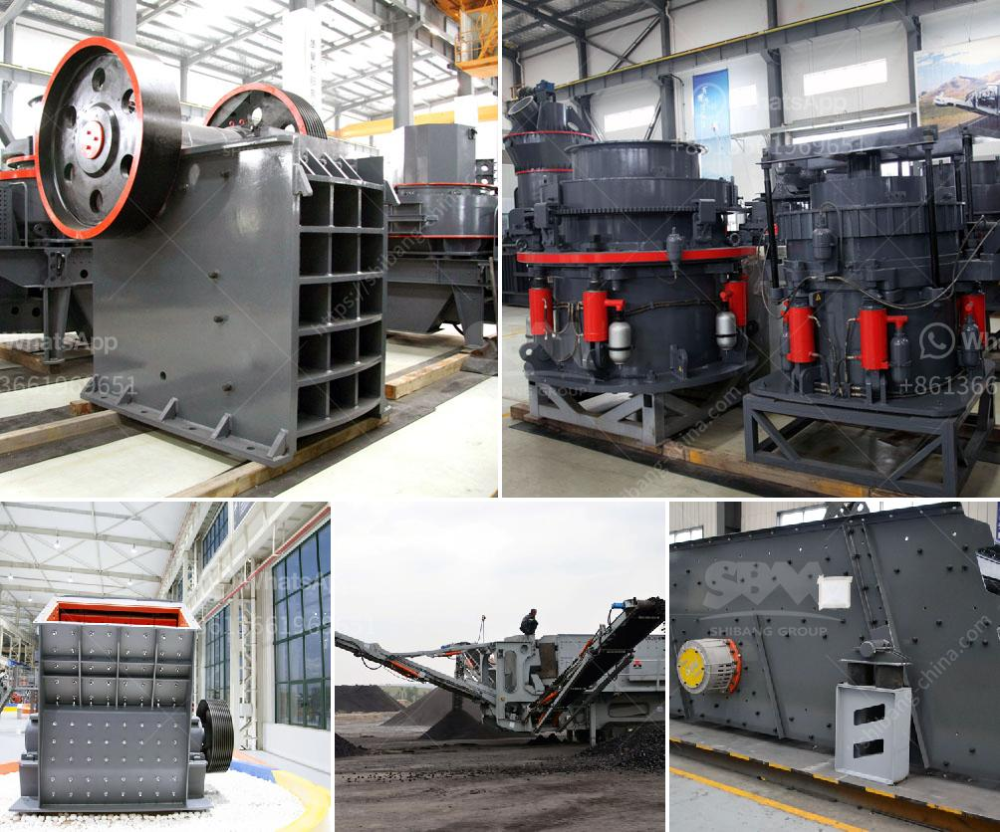

<h3>copper recycling process</h3>
Copper is a versatile and widely used metal that plays a crucial role in various industries, including construction, electronics, transportation, and power generation. However, the extraction and production of copper from its raw form can have significant environmental and social impacts. As awareness of these issues grows, so does the importance of copper recycling as a sustainable solution.

The process of recycling copper involves collecting and sorting scrap copper materials, such as wires, pipes, and electrical components, and transforming them into useful new products. This process conserves natural resources, reduces energy consumption, and minimizes waste.

The first step in copper recycling is the collection of scrap copper materials. This can be done through various methods, such as household recycling programs, collection centers, or even contacting scrap metal dealers directly. Once collected, the scrap copper is sorted based on its composition and purity. This is crucial to ensure that the resulting recycled copper maintains the required quality standards.

After sorting, the scrap copper is subjected to a series of processes to remove impurities and contaminants. This includes removing any non-metallic materials, such as plastic or rubber insulation, through mechanical or thermal methods. The remaining copper is then shredded or crushed into smaller pieces, improving its handling and processing efficiency.

The next step is smelting, where the shredded copper is melted in a high-temperature furnace. During this process, any remaining impurities are removed, and the molten copper is purified. The purified copper is then cast into molds, forming ingots or billets, which can be further processed into different copper products.

The recycled copper can be used to produce a wide range of products, including electrical wires, plumbing pipes, industrial machinery, and electronic components. These recycled copper products have the same quality and performance as those made from newly mined copper, but with significantly reduced environmental impacts.

One of the key advantages of copper recycling is its ability to conserve natural resources. Mining and extracting copper from ore is a resource-intensive process that requires significant energy consumption and causes habitat destruction. By recycling copper, we can reduce the need for new mining operations and preserve valuable resources for future generations.

Moreover, the recycling process significantly reduces energy consumption. Producing copper from recycled materials requires up to 85% less energy compared to extracting copper from its raw form. This energy savings not only reduces greenhouse gas emissions but also helps in mitigating climate change.

Copper recycling also plays a vital role in waste management. Properly recycling copper materials prevents them from ending up in landfills, where they can take hundreds of years to decompose. By diverting copper scrap from landfills, we can reduce the space needed for waste disposal and minimize potential leakage of harmful substances into the environment.

In conclusion, copper recycling offers numerous environmental and economic benefits. It conserves natural resources, reduces energy consumption, and helps in waste management. As the demand for copper continues to rise, the importance of recycling this valuable metal becomes even more critical. Therefore, individuals, industries, and governments should actively participate in copper recycling programs to support a sustainable and greener future.
<h3>Contact us</h3><ul><li><strong>Whatsapp:&nbsp;<a href="https://wa.me/8613661969651">+8613661969651</a></strong></li><li><a href="https://swt.shibang-china.com/?git&amp;zhl&amp;copper recycling process"><strong>Online Service(chat now)</strong></a></li></ul><h3>Related</h3><ul><li><a href='basalt crushing plant.md'>basalt crushing plant</a></li><li><a href='pe 500 750 jaw crusher price.md'>pe 500 750 jaw crusher price</a></li><li><a href='jaw crusher ethiopia.md'>jaw crusher ethiopia</a></li><li><a href='china granite jaw crusher.md'>china granite jaw crusher</a></li><li><a href='price list stone crusher machine guangzhou.md'>price list stone crusher machine guangzhou</a></li></ul>