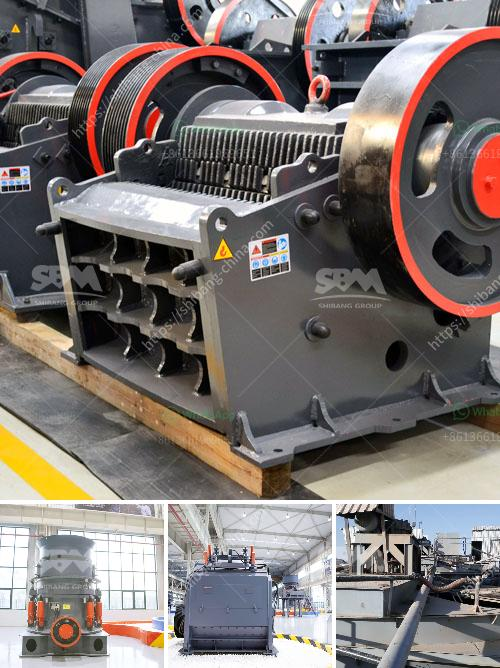

<h3>copper refinery machine south africa</h3>
South Africa is a country rich in natural resources, with significant deposits of minerals like gold, platinum, and copper. As one of the world's leading producers of copper, South Africa is home to several copper mines, where the metal is extracted from the earth to be processed into various products. The copper refinery machine plays a crucial role in this process, contributing to the growth of the local economy and the mining industry.

The copper refinery machine is an essential piece of equipment used in the smelting and refining processes. It helps to extract pure copper from copper ore, which is typically mined from underground or open-pit mines. Once the copper ore is extracted, it undergoes a series of crushing, grinding, and flotation processes to separate the copper from other minerals and impurities.

South Africa's copper refinery machines are known for their high efficiency and advanced technology. They are designed to handle large-scale operations, processing large quantities of copper ore to meet the growing global demand. These machines are equipped with cutting-edge equipment, such as crushers, mills, and flotation cells, which facilitate the extraction and purification of copper.

The operation of the copper refinery machine involves several steps. First, the copper ore is crushed into smaller pieces using crushers. Then, the crushed ore is ground into a fine powder in mills, where it is mixed with water and chemicals to create a slurry. The slurry is then passed through flotation cells, where air is introduced to generate bubbles that attach to the copper particles, causing them to rise to the surface. The copper concentrate is then collected and dried, ready for further processing or transportation to smelters.

The efficient operation of copper refinery machines in South Africa has significant economic benefits. Firstly, it contributes to job creation by employing a large number of workers, including engineers, technicians, and laborers, both directly and indirectly. These workers are essential for the smooth operation and maintenance of the refinery machines, ensuring optimal performance.

Secondly, the production of refined copper enhances South Africa's export potential. The country can export the refined copper to international markets, earning foreign exchange and contributing to its balance of trade. As copper is widely used in various industries, including construction, electronics, and transportation, the demand for South Africa's refined copper remains steady, presenting lucrative export opportunities.

Lastly, the presence of copper refinery machines in South Africa supports the growth of the local mining industry. Large-scale copper mining operations rely on these machines to process and refine the copper ore, making it economically viable for companies to invest in mining projects. This, in turn, promotes further exploration and development of copper deposits, ensuring a sustainable supply of copper for both local consumption and export.

In conclusion, the copper refinery machine in South Africa plays a vital role in boosting the local economy and the mining industry. With its advanced technology and efficiency, it enables the extraction and refining of copper ore, creating job opportunities and supporting the export of refined copper. The presence of these machines also stimulates the growth of the mining sector, contributing to the overall economic development of the country.
<h3>Contact us</h3><ul><li><strong>Whatsapp:&nbsp;<a href="https://wa.me/8613661969651">+8613661969651</a></strong></li><li><a href="https://swt.shibang-china.com/?git&amp;zhl&amp;copper refinery machine south africa"><strong>Online Service(chat now)</strong></a></li></ul><h3>Related</h3><ul><li><a href='ton per hour gold wash plant.md'>ton per hour gold wash plant</a></li><li><a href='blands of quarry crusher plant ball mill.md'>blands of quarry crusher plant ball mill</a></li><li><a href='crusher plant quarry philippines.md'>crusher plant quarry philippines</a></li><li><a href='stone crusher philippines.md'>stone crusher philippines</a></li><li><a href='double rotor hammer crusher.md'>double rotor hammer crusher</a></li></ul>