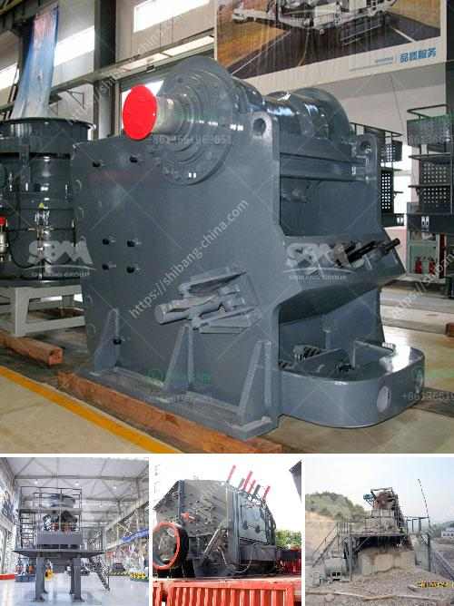

<h3>cost estimates of a chrome processing plant</h3>
Chrome, also known as chromium, is an essential element used in various industrial applications. It is primarily used in the production of stainless steel, as well as in the manufacturing of alloys, pigments, and chemicals. Given its widespread use, the demand for chrome remains steady, making it an attractive investment opportunity. If you are considering setting up a chrome processing plant, it is crucial to understand the cost estimates involved in the venture.

The cost of establishing a chrome processing plant can vary significantly depending on several factors, such as the plant's size, location, and processing capabilities. To provide a rough estimate, let's consider a medium-sized plant with an average production capacity.

First and foremost, the cost of land acquisition plays a crucial role in the project's overall expenses. The location of the plant should be selected strategically, considering several aspects, including accessibility to raw materials, availability of utilities, and proximity to potential customers. Depending on the region, land acquisition costs can range from a few hundred thousand dollars to several million dollars, significantly impacting the initial investment.

Once the land is secured, the next significant expense is construction and infrastructure. Building a chrome processing plant requires the construction of various facilities, including storage areas, processing units, laboratories, and administrative buildings. The total cost of construction can vary depending on the complexity and scale of the plant but can typically range from a few million dollars to tens of millions.

Another cost to consider is the procurement of equipment and machinery necessary for the processing plant. This includes crushers, screens, conveyors, mills, and other specialized machinery required to extract and process chrome ore. The cost of acquiring these equipment can vary depending on their capacity, quality, and whether they are purchased new or used. Typically, investing in high-quality equipment is recommended for better efficiency and longevity, but this comes at a higher price.

Apart from the equipment cost, there are additional expenditures associated with the plant's operations. This includes utilities such as electricity, water supply, and fuel, as well as regular maintenance and repair expenses. These ongoing costs should be factored into the financial projections to accurately estimate the plant's overall expenses.

Furthermore, it is crucial to consider labor costs. A chrome processing plant would require a skilled workforce to handle various operations, including mining, processing, quality control, and administration. Some of these roles might require specialized knowledge and experience, which can impact labor costs. Additionally, employee benefits, training programs, and safety measures should also be accounted for.

Lastly, it is crucial to consider overhead expenses, such as administrative and marketing costs. This includes salaries for management personnel, office rent, insurance, and advertising expenses to promote the products manufactured by the plant, ensuring a steady stream of customers.

In conclusion, setting up a chrome processing plant involves significant expenses. Land acquisition, construction, equipment procurement, labor costs, and ongoing operational expenses should all be meticulously estimated for effective financial planning. It is essential to conduct thorough research, obtain multiple quotations, and consult experts in the field to develop a comprehensive cost estimate to ensure the success of your investment in a chrome processing plant.
<h3>Contact us</h3><ul><li><strong>Whatsapp:&nbsp;<a href="https://wa.me/8613661969651">+8613661969651</a></strong></li><li><a href="https://swt.shibang-china.com/?git&amp;zhl&amp;cost estimates of a chrome processing plant"><strong>Online Service(chat now)</strong></a></li></ul><h3>Related</h3><ul><li><a href='chinese mobile crusher.md'>chinese mobile crusher</a></li><li><a href='limestone processing crusher.md'>limestone processing crusher</a></li><li><a href='hammer mill and ball mill.md'>hammer mill and ball mill</a></li><li><a href='crushers south africa.md'>crushers south africa</a></li><li><a href='cement formation process.md'>cement formation process</a></li></ul>