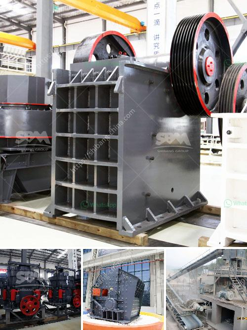

<h3>cost for the ball mill machines</h3>
The ball mill machine is undoubtedly a crucial piece of machinery in the manufacturing industry. It is used for various processes like mixing raw materials, preparing paints, pyrotechnics, and ceramics. The mill's working principle is based on the impact and attrition between the grinding balls and the inner surface of the mill jar. However, one factor that plays a determinant role in the selection of a ball mill machine is the cost associated with it.

The cost of ball mill machines can vary depending on certain factors. Let's delve deeper into the specifics to gain a comprehensive understanding of the cost implications.

1. Type of Ball Mill Machine: Different ball mill machines are designed for various purposes and industries. The cost can vary greatly depending on the ball mill's specifications, capabilities, and intended application. For example, a machine that is specifically designed for pharmaceutical processes will tend to be more expensive than a machine used in a general-purpose laboratory.

2. Material and Construction Quality: The materials used in the construction of a ball mill machine significantly affect its cost. High-quality materials like stainless steel, ceramics, or special alloys enhance the durability and performance of the machine, resulting in a higher cost. However, investing in superior material ensures longevity and may reduce future maintenance and replacement costs.

3. Capacity and Size: The capacity and size of the ball mill machine determine its price. Larger machines are generally more expensive due to the increased materials required for construction. In addition, larger machines often have higher production capabilities, which can be a significant advantage in certain industries. However, it is important to consider the specific requirements of your application to avoid unnecessary expenses associated with oversized equipment.

4. Manufacturer and Brand: The reputation, reliability, and brand name of the manufacturer can influence the cost of ball mill machines. Established manufacturers with a strong track record often charge a premium for their products. However, choosing a well-known and reputable manufacturer ensures that you are investing in a reliable and high-quality machine, which can ultimately be cost-effective in the long run.

5. Additional Features and Accessories: Some ball mill machines come with additional features and accessories that enhance their functionality and ease of use. These can include digital controls, sensors, automated loading and unloading systems, and safety features. While these features may increase the upfront cost, they can improve productivity, reduce downtime, and minimize human error, ultimately leading to long-term savings.

In conclusion, the cost of ball mill machines can vary significantly depending on factors such as the type of machine, materials used, capacity, size, manufacturer, and additional features. As a buyer, it is crucial to carefully assess your requirements, conduct market research, and compare different options to ensure you obtain the most cost-effective solution. Balancing initial investment with long-term maintenance and performance can help you make an informed decision and maximize the return on your investment in ball mill machines.
<h3>Contact us</h3><ul><li><strong>Whatsapp:&nbsp;<a href="https://wa.me/8613661969651">+8613661969651</a></strong></li><li><a href="https://swt.shibang-china.com/?git&amp;zhl&amp;cost for the ball mill machines"><strong>Online Service(chat now)</strong></a></li></ul><h3>Related</h3><ul><li><a href='stone crushing machines in canada.md'>stone crushing machines in canada</a></li><li><a href='pulverizer crusher manufacturers in pune.md'>pulverizer crusher manufacturers in pune</a></li><li><a href='cone crusher manufacturers china.md'>cone crusher manufacturers china</a></li><li><a href='granite mining equipment.md'>granite mining equipment</a></li><li><a href='cement clinker grinding unit.md'>cement clinker grinding unit</a></li></ul>