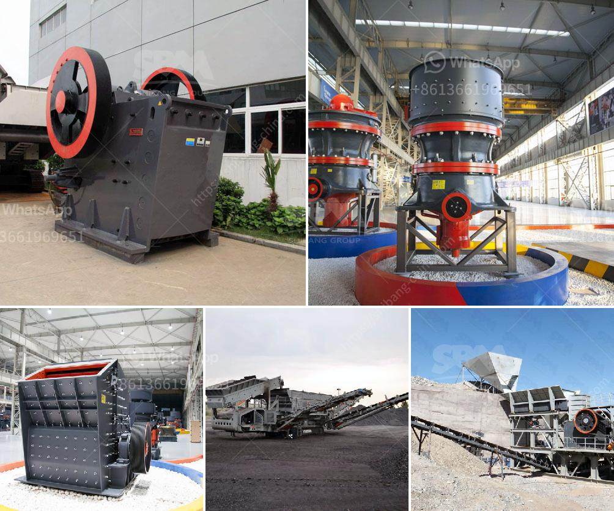

<h3>cost in india of 100 ton mobile limestone crusher</h3>
India is the world’s second-largest producer of limestone, with abundant reserves of the mineral spread across the region. The cost of limestone varies widely throughout the country and is determined mainly by the availability and quality of the resource. A 100 ton mobile limestone crusher is a major investment, as you need high-quality equipment to ensure efficient operation and lasting durability.

The cost of a mobile limestone crusher will depend on factors such as the type of crusher, operating cost, availability of labor, machinery, and equipment required, and the specific demands of the project. It's essential to assess these factors before committing to a purchase to ensure you get the most value for your investment.

In India, the average cost of a 100 ton mobile limestone crusher ranges from Rs. 1 crore to Rs. 7 crore, depending on the quality, size, and capacity. However, the price may vary significantly if additional features and functionalities are added to the basic model.

When considering the cost of a mobile limestone crusher, it is crucial to evaluate the operating cost, including the cost of diesel or electricity required to power the crusher. The availability of these resources in the area where the crusher will be used plays a vital role in determining the overall operating cost.

Another significant factor affecting the cost is the availability of labor in the region. Skilled labor is essential for the maintenance and operation of the crusher, and if the region lacks skilled labor, you may need to bear additional expenses for training or importing labor from other areas.

Machinery and equipment costs are also essential factors to consider. Manufacturing and importing costs vary depending on the brand, quality, and origin of the equipment. It is recommended to do thorough market research and compare prices from multiple suppliers to ensure you get the best deal.

The specific demands of the project, such as the required size of output material and production capacity, will also play a role in the cost. A higher production capacity or a more refined output may require additional features, resulting in a higher cost.

Apart from the initial purchase cost, it is crucial to consider the long-term costs associated with the crusher, such as maintenance and spare parts. Ensuring the availability of spare parts and the presence of a service center in the vicinity can minimize operational downtime and reduce maintenance costs.

Overall, the cost of a 100 ton mobile limestone crusher in India can vary significantly depending on various factors. It is important to undertake proper research and assessment to get accurate cost estimates from suppliers or manufacturers. Evaluating factors such as operating cost, labor availability, machinery cost, and project demands will help you make an informed decision and ensure that your investment in a mobile limestone crusher is worthwhile.
<h3>Contact us</h3><ul><li><strong>Whatsapp:&nbsp;<a href="https://wa.me/8613661969651">+8613661969651</a></strong></li><li><a href="https://swt.shibang-china.com/?git&amp;zhl&amp;cost in india of 100 ton mobile limestone crusher"><strong>Online Service(chat now)</strong></a></li></ul><h3>Related</h3><ul><li><a href='limestone grinding roller mill.md'>limestone grinding roller mill</a></li><li><a href='china raymond roller mills.md'>china raymond roller mills</a></li><li><a href='washing powder production line.md'>washing powder production line</a></li><li><a href='hard stone crush maker pakistan.md'>hard stone crush maker pakistan</a></li><li><a href='how to make a vibrating screen.md'>how to make a vibrating screen</a></li></ul>