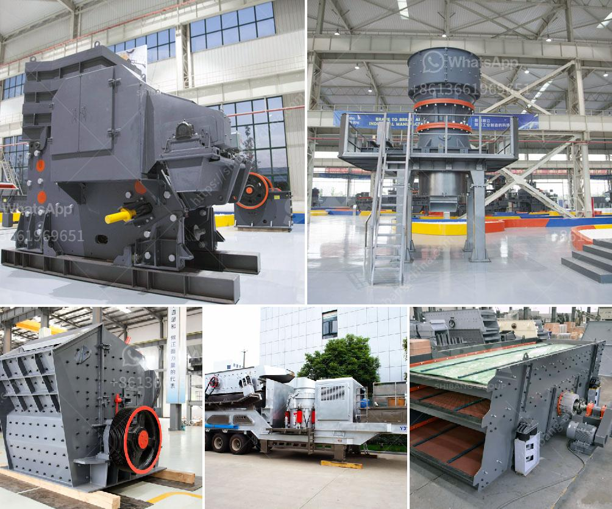

<h3>cost of 200 tpd clinker grinding plant</h3>
The cost of setting up a 200 TPD clinker grinding plant can vary depending on various factors. This article will provide an insight into the cost of setting up a clinker grinding plant.

A clinker grinding plant is a specialized project that requires a set of machinery and equipment to produce finished cement products. The production capacity is usually specified in terms of the clinker processing units per day (TPD).

The cost of setting up a clinker grinding plant can vary depending on factors such as the location, size of the plant, and the specific requirements of the project. Let's break down the cost into different components.

1. Land and Site Development: The first step is to acquire land for the plant. The cost of land can vary widely depending on the location and market conditions. Additionally, site development costs such as grading, leveling, and infrastructure development need to be considered.

2. Machinery and Equipment: The heart of a clinker grinding plant is the clinker grinding unit (CGU). This equipment is used to grind the clinker into the desired fineness required for producing cement. The machinery and equipment required for a 200 TPD clinker grinding plant can include various types of crushers, mills, separators, conveyors, and other auxiliary equipment. The cost of these machinery and equipment can be a significant portion of the total project cost.

3. Civil and Structural Works: The construction of the plant requires civil and structural works. This includes components such as the building for housing the machinery, storage facilities, silos, and other support structures. The cost of civil and structural works can depend on the size and complexity of the plant.

4. Electrical and Instrumentation: A clinker grinding plant requires a robust electrical and instrumentation control system to operate efficiently and safely. This includes power distribution, motor control centers, control panels, and various instruments and sensors. The cost of electrical and instrumentation works can vary depending on the plant's requirements and technology used.

5. Environmental Considerations: In today's environmentally conscious world, a clinker grinding plant needs to comply with various environmental regulations. This can include the installation of pollution control equipment such as dust collectors, air pollution control systems, and wastewater treatment facilities. The cost of these environmental considerations can also contribute to the overall project cost.

6. Installation and Commissioning: Once the machinery and equipment are procured, the installation and commissioning of the clinker grinding plant need to be carried out. This includes hiring skilled labor, supervision, and testing and commissioning of the plant. The cost of installation and commissioning can depend on the complexity of the plant and the availability of qualified manpower.

It is difficult to provide a precise cost for setting up a 200 TPD clinker grinding plant as it can vary depending on various factors. However, based on past projects and market rates, the total cost can range from USD 3 million to USD 7 million or more.

In conclusion, setting up a 200 TPD clinker grinding plant requires careful planning, budgeting, and coordination of various components. From land acquisition to machinery procurement, civil works to installation, and commissioning, each aspect contributes to the overall cost. It is essential to engage with experienced consultants and vendors to ensure a successful and cost-effective project execution.
<h3>Contact us</h3><ul><li><strong>Whatsapp:&nbsp;<a href="https://wa.me/8613661969651">+8613661969651</a></strong></li><li><a href="https://swt.shibang-china.com/?git&amp;zhl&amp;cost of 200 tpd clinker grinding plant"><strong>Online Service(chat now)</strong></a></li></ul><h3>Related</h3><ul><li><a href='ball mill manufacturers in pune.md'>ball mill manufacturers in pune</a></li><li><a href='gold processing equipment for sale in zimbabwe.md'>gold processing equipment for sale in zimbabwe</a></li><li><a href='stone crusherproduction line.md'>stone crusherproduction line</a></li><li><a href='how to make a vibrating screen.md'>how to make a vibrating screen</a></li><li><a href='limestone micronizer machine limestone micronizer mill.md'>limestone micronizer machine limestone micronizer mill</a></li></ul>