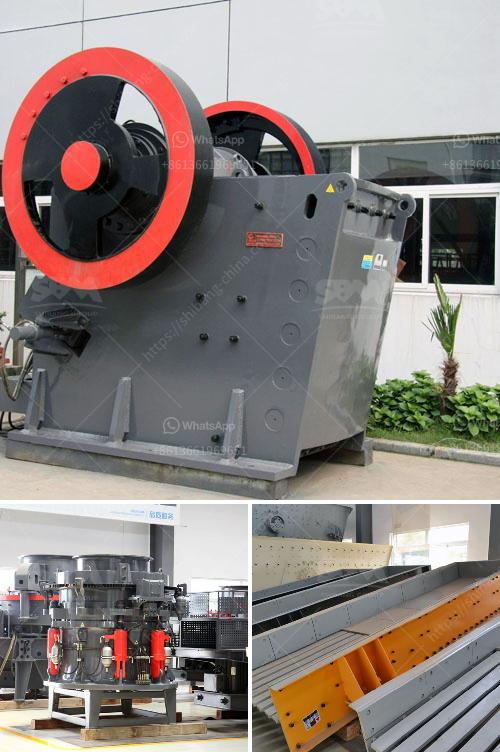

<h3>cost of cement manufacturing plant tons per day</h3>
The cost of setting up a cement manufacturing plant can vary greatly depending on the size, location, and specific requirements of the project. However, on average, the cost of setting up a cement plant ranges from around $1,500 to $1,800 per ton of cement production capacity.

The high initial investment cost is one of the major hurdles for the cement production industry. A cement plant with a production capacity of 1 million tons per year is considered to be a mid-sized plant, and its initial investment can range from $50 million to $100 million, or even more. This includes the cost of land acquisition, construction, machinery, and other infrastructure.

The cost per ton of cement production decreases as the plant size increases. For example, a cement plant with a production capacity of 2 million tons per year can cost around $3,500 to $4,000 per ton of cement production capacity. On the other hand, a cement plant with a production capacity of 1,000 tons per day would be more expensive, costing up to $5,000 per ton.

The location of the plant also plays a significant role in determining the cost. Plants that are located near limestone reserves, a key ingredient in cement production, can benefit from lower transportation costs, resulting in lower overall costs. Additionally, proximity to transportation networks and other utilities can have a significant impact on the total investment required.

Operational costs, including raw material and energy costs, labor, maintenance, and other overhead expenses, are additional factors that need to be considered. These costs can vary depending on the efficiency of the plant and local market conditions.

Furthermore, regulatory requirements, environmental permits, and compliance measures can also add to the overall cost. The implementation of pollution control measures and waste management systems can further increase the expenses associated with setting up and operating a cement plant.

It is important to note that the cost estimates mentioned above are approximate figures based on industry standards and market trends. The actual cost may vary significantly depending on specific factors and conditions.

In conclusion, setting up a cement manufacturing plant involves substantial capital investment. The costs can vary depending on plant size, location, and specific requirements. Detailed cost analysis and feasibility studies are necessary to accurately estimate the cost of setting up a cement plant. Additionally, factors such as operational costs, regulatory compliance, and environmental measures should also be taken into consideration.
<h3>Contact us</h3><ul><li><strong>Whatsapp:&nbsp;<a href="https://wa.me/8613661969651">+8613661969651</a></strong></li><li><a href="https://swt.shibang-china.com/?git&amp;zhl&amp;cost of cement manufacturing plant tons per day"><strong>Online Service(chat now)</strong></a></li></ul><h3>Related</h3><ul><li><a href='crusher price in kazakhstan.md'>crusher price in kazakhstan</a></li><li><a href='types of limestone crusher.md'>types of limestone crusher</a></li><li><a href='china cone crushers.md'>china cone crushers</a></li><li><a href='packing plant in cement industry.md'>packing plant in cement industry</a></li><li><a href='cost000 tpd cement project ore processing.md'>cost000 tpd cement project ore processing</a></li></ul>