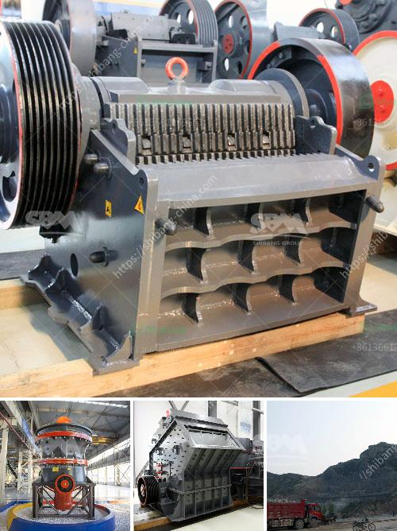

<h3>cost of complete stone crushing plant in ghana</h3>
The cost of building a complete stone crushing plant in Ghana is dependent on several factors including the size, scale, location, and the type of stone and materials used. However, the most significant factors influencing the costs of the stone crushing plant are the machines and equipment used in the plant. Additionally, the economic and social environment surrounding the project will have a significant impact on the pricing.

One of the main considerations when determining the budget for a stone crushing plant in Ghana is the price of the machines, which will determine the scope of the project. The main equipment used in the stone crushing plant includes vibrating feeder, jaw crusher, impact crusher, circular vibrating screen, belt conveyors, and other auxiliary equipment. The total cost of the equipment is between $15,000 and $100,000.

Concrete batching plants and concrete mixers are also crucial equipment in stone crushing plants. These devices are responsible for the transportation of raw materials and cement to the crushing plant, as well as the loading and unloading of materials. The prices of these machines vary depending on their size and capacity but typically range from $10,000 to $100,000.

Apart from the cost of machines and equipment, other factors that contribute to the overall cost of a stone crushing plant in Ghana include labor, fuel, maintenance, and insurance expenses. Additionally, the cost of permits and licenses needed for the establishment and operation of the plant should be considered.

The economic and social environment of the project location also has a significant impact on the cost of a stone crushing plant. Factors such as the availability and cost of raw materials, transportation costs, and local regulations and taxes may vary from region to region, affecting the total cost of the project.

In conclusion, the cost of building a complete stone crushing plant in Ghana is determined by several factors such as the size, scale, location, and the type of stone and materials used. The machines and equipment required also influence the costs. However, the economic and social environment of the project location will play a significant role in determining the final cost of the project.
<h3>Contact us</h3><ul><li><strong>Whatsapp:&nbsp;<a href="https://wa.me/8613661969651">+8613661969651</a></strong></li><li><a href="https://swt.shibang-china.com/?git&amp;zhl&amp;cost of complete stone crushing plant in ghana"><strong>Online Service(chat now)</strong></a></li></ul><h3>Related</h3><ul><li><a href='gypsum granules plant manufacturer in india.md'>gypsum granules plant manufacturer in india</a></li><li><a href='demand of stage concassage mobile.md'>demand of stage concassage mobile</a></li><li><a href='track impact crusher.md'>track impact crusher</a></li><li><a href='roll crusher used equipment.md'>roll crusher used equipment</a></li><li><a href='coal mill manufacturer china.md'>coal mill manufacturer china</a></li></ul>