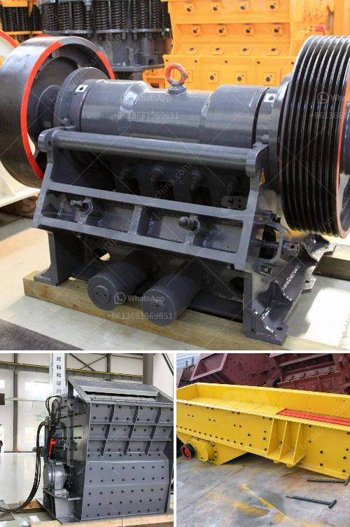

<h3>cost of feldsper processing machine</h3>
The cost of feldspar processing machines can vary depending on several factors such as the type of machine, the brand, the capacity, and the specific requirements of the project. In this article, we will explore the different aspects that influence the cost of feldspar processing machines.

Feldspar is a common mineral used in various industrial applications, including ceramics, glass making, and paints. The process of extracting and processing feldspar involves several stages, such as crushing, grinding, screening, and magnetic separation.

The first factor that affects the cost of feldspar processing machines is the type of machine required for the specific process. There are various types of equipment available in the market, such as jaw crushers, cone crushers, impact crushers, and grinding mills. Each machine is designed for specific tasks and has different price ranges. For instance, a jaw crusher is suitable for primary crushing of feldspar, while a grinding mill is used for grinding the crushed feldspar into finer particles.

The brand of the machine also plays a role in determining the cost. Well-known and established brands tend to have higher prices due to their reputation, quality, and after-sales support. However, there are also smaller, lesser-known brands that offer competitive prices while maintaining good quality. It is essential to research and compare different brands to find the right balance between cost and quality.

Another important consideration is the capacity of the machine. The processing capacity required for a project can range from small to large scale. Machines with higher capacity generally come with a higher price tag. It is crucial to determine the production requirements and find a machine that meets those needs without overspending on unnecessary capacity.

Furthermore, the specific requirements of the project can affect the cost. Different feldspar deposits have varying mineral compositions and impurities. Some projects may require additional steps or specialized equipment to remove impurities, which can increase the overall cost. It is essential to have a clear understanding of the project requirements to estimate the cost accurately.

In addition to the machine cost, there are other expenses to consider, such as installation, maintenance, and spare parts. These costs can vary depending on the complexity of the machine and the availability of support from the manufacturer or distributor. It is advisable to factor in these expenses while evaluating the overall cost of feldspar processing machines.

To get an accurate cost estimate, it is recommended to reach out to manufacturers, suppliers, or distributors directly. They can provide detailed information about the machines, their prices, and any additional expenses. Additionally, consulting experts in the field or conducting a feasibility study can help in understanding the specific requirements and estimating the overall cost more effectively.

In conclusion, the cost of feldspar processing machines can vary based on several factors, including the type of machine, brand, capacity, and project requirements. Proper research, evaluation, and consultation are essential to find the right machine within the desired price range while ensuring the quality and efficiency of the processing process.
<h3>Contact us</h3><ul><li><strong>Whatsapp:&nbsp;<a href="https://wa.me/8613661969651">+8613661969651</a></strong></li><li><a href="https://swt.shibang-china.com/?git&amp;zhl&amp;cost of feldsper processing machine"><strong>Online Service(chat now)</strong></a></li></ul><h3>Related</h3><ul><li><a href='iron ore cruseher plant price.md'>iron ore cruseher plant price</a></li><li><a href='small sacle crushers in zambia.md'>small sacle crushers in zambia</a></li><li><a href='coal crushing machine in east rand.md'>coal crushing machine in east rand</a></li><li><a href='gypsum board plant cost.md'>gypsum board plant cost</a></li><li><a href='used limestone milling machine.md'>used limestone milling machine</a></li></ul>