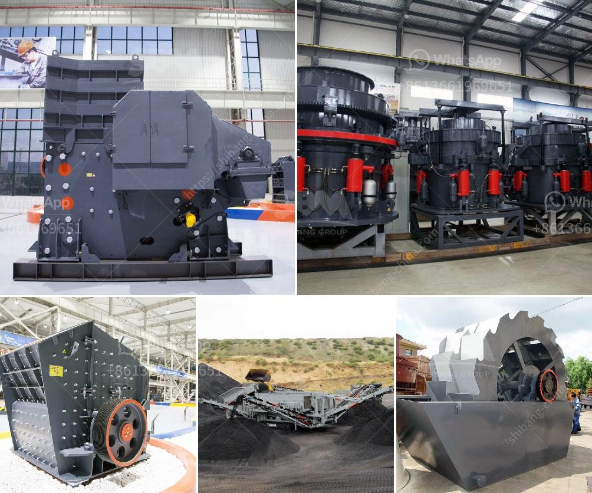

<h3>cost of jaw crusher in kenya</h3>
The cost of a jaw crusher in Kenya is influenced by various factors, including the number of jaw crushers on the market, the size of the crushers, the crushing capacity, and the manufacturing process used to produce them.

These factors determine the cost of the jaw crusher and affect its price. With the continuous advancement of technology and the increasing demand for equipment in the market, the cost of jaw crushers in Kenya is becoming more and more expensive.

One of the main factors affecting the cost of jaw crushers is the size and crushing capacity of the equipment. Generally, a jaw crusher with a larger size has a higher cost, while a jaw crusher with a smaller size has a lower cost. This is because the larger the size of the jaw crusher, the more materials it can process at a time, which in turn increases its production capacity. However, the larger size also means higher manufacturing costs, resulting in a higher price.

Another factor that affects the cost of jaw crushers in Kenya is the manufacturing process used to produce the equipment. The manufacturing process includes various steps, such as material selection, processing, and assembly. Different manufacturing processes have different costs. For example, a jaw crusher produced through advanced technology and automation may have a higher cost than a jaw crusher produced through manual labor.

Furthermore, the number of jaw crushers on the market also affects their prices. If there are only a few jaw crushers available, the competition is low, and the prices may be higher. On the other hand, if there are many jaw crushers on the market, the competition is high, and the prices may be more competitive. Therefore, the availability of jaw crushers in Kenya affects their cost.

Additionally, the cost of jaw crushers in Kenya may also be influenced by factors such as transportation costs, importation taxes, and other fees. If the jaw crushers need to be imported from another country, the cost will naturally be higher due to the transportation fees and importation taxes incurred.

In conclusion, the cost of a jaw crusher in Kenya is influenced by various factors, including the size and crushing capacity of the equipment, the manufacturing process, the number of jaw crushers available in the market, and other related costs. As technology advances and demand increases, the price of jaw crushers in Kenya is expected to rise. However, it is essential to compare prices and consider different factors before making a purchase decision to ensure that you get the best value for your money.
<h3>Contact us</h3><ul><li><strong>Whatsapp:&nbsp;<a href="https://wa.me/8613661969651">+8613661969651</a></strong></li><li><a href="https://swt.shibang-china.com/?git&amp;zhl&amp;cost of jaw crusher in kenya"><strong>Online Service(chat now)</strong></a></li></ul><h3>Related</h3><ul><li><a href='cara pemasangan belt conveyor.md'>cara pemasangan belt conveyor</a></li><li><a href='part of ball mill.md'>part of ball mill</a></li><li><a href='jaw crusher prices.md'>jaw crusher prices</a></li><li><a href='single super phosphate plants in germany.md'>single super phosphate plants in germany</a></li><li><a href='hammer crusher micron size product.md'>hammer crusher micron size product</a></li></ul>