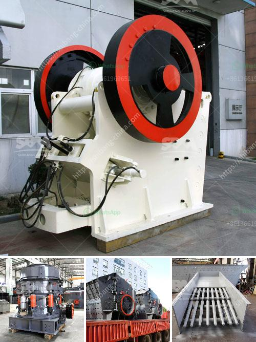

<h3>cost of mining conveyor belt</h3>
The cost of mining conveyor belts is an important consideration for mining companies. Conveyor belts play a crucial role in transporting materials and products throughout the mining process. They are the lifeline of any mining operation and their failure can result in costly downtime.

Mining conveyor belts are subjected to extreme conditions, including abrasive materials, heavy loads, and high temperatures. Therefore, they need to be durable, reliable, and able to withstand harsh mining environments. As a result, the cost of mining conveyor belts can vary significantly depending on a range of factors.

One of the main factors affecting the cost of mining conveyor belts is the material used for their construction. Traditional conveyor belts were made of rubber and fabric layers, but modern belts often incorporate synthetic materials such as nylon, polyester, or steel reinforcements. These materials offer higher tensile strength, improved resistance to abrasion and impact, and increased durability.

The length and width of the conveyor belt also impact its cost. Longer and wider belts require more materials and labor for manufacturing, resulting in higher costs. In addition, the conveyor belt's thickness can affect its price. Thicker belts generally offer better durability and longer lifespan but can be more expensive.

Another critical factor influencing the cost of mining conveyor belts is the type of belt design. There are different types of belts available, such as flat belts, trough belts, and pipe belts. Each design has its advantages and disadvantages, and their cost varies accordingly. Flat belts are the most common type of conveyor belts, while trough belts are suitable for transporting bulk materials. Pipe belts, on the other hand, are used for uphill or downhill transportation.

Apart from the initial purchase cost, ongoing maintenance and repair costs should also be considered. Regular maintenance is essential to ensure the optimal performance and longevity of the conveyor belt. Various costs associated with maintenance, such as inspections, cleaning, and lubrication, should be factored into the overall cost.

Additionally, the installation process can impact the overall cost of mining conveyor belts. Installing a conveyor belt requires professional expertise and specialized equipment, which can result in higher installation costs for larger systems or complex layouts. It is crucial to choose an experienced installation team to guarantee a smooth and efficient installation process.

Lastly, geographical location and transportation costs can affect the final price of mining conveyor belts. If mining operations are located in remote areas, transportation costs may be higher, as the belts will need to be transported over long distances. Importing conveyor belts from overseas suppliers can also incur additional costs, including customs duties and shipping fees.

In conclusion, the cost of mining conveyor belts can vary depending on several factors. Material composition, belt length and width, design type, ongoing maintenance expenses, installation, and geographical location are all factors that contribute to the final cost. Mining companies need to carefully evaluate these factors to find the most cost-effective and reliable conveyor belt solution for their operations. Investing in high-quality conveyor belts can result in enhanced productivity, reduced downtime, and ultimately, increased profitability.
<h3>Contact us</h3><ul><li><strong>Whatsapp:&nbsp;<a href="https://wa.me/8613661969651">+8613661969651</a></strong></li><li><a href="https://swt.shibang-china.com/?git&amp;zhl&amp;cost of mining conveyor belt"><strong>Online Service(chat now)</strong></a></li></ul><h3>Related</h3><ul><li><a href='stone crushers for sale in south africa.md'>stone crushers for sale in south africa</a></li><li><a href='used stone crusher machine for sale in philippines.md'>used stone crusher machine for sale in philippines</a></li><li><a href='samp hammer mill china.md'>samp hammer mill china</a></li><li><a href='feldspar powder suppliers.md'>feldspar powder suppliers</a></li><li><a href='jaw crusher for sale in ghana.md'>jaw crusher for sale in ghana</a></li></ul>