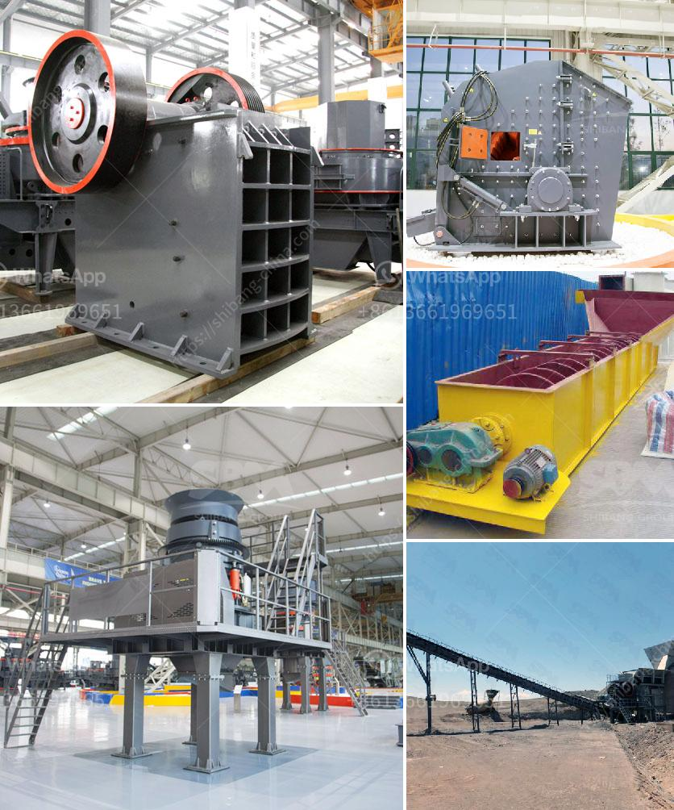

<h3>cost of setting up a limestone processing unit</h3>
Setting up a limestone processing unit can be a challenging task. However, it is an excellent investment opportunity that provides a high return on investment. Limestone is a versatile resource used in various industries such as construction, agriculture, and manufacturing. It is widely used as a raw material in cement production, as a soil amendment in agriculture, and as a filler in various products.

The cost of setting up a limestone processing unit depends on several factors. Firstly, the location of the unit plays a significant role in determining the costs. If the processing unit is located near the limestone quarry, transportation costs are reduced, resulting in lower expenses. Additionally, the availability of skilled labor in the area also affects the overall cost.

The next significant factor is the scale of the unit. A limestone processing unit with a capacity of 100 to 300 tons per day can range from $500,000 to $1 million. This includes machinery, equipment, land, building, and other miscellaneous expenses. However, these costs can vary depending on the complexity of the processing unit and the market conditions.

The machinery and equipment required for a limestone processing unit include crushers, conveyors, dust collectors, and various types of mills for pulverizing limestone into different grades. These machines must be of good quality and compliant with safety standards, which can add to the overall cost.

Apart from the initial capital investment, operational costs such as raw material procurement, labor, maintenance, and administrative expenses should also be considered. It is essential to have a comprehensive business plan and financial projections to accurately estimate the ongoing costs and ensure a profitable operation.

Setting up a limestone processing unit can be a lucrative business venture with the right planning and execution. With the growing demand for limestone-based products, the market potential is promising. Conducting thorough market research, seeking professional guidance, and ensuring cost-effective operations will pave the way for a successful limestone processing unit.
<h3>Contact us</h3><ul><li><strong>Whatsapp:&nbsp;<a href="https://wa.me/8613661969651">+8613661969651</a></strong></li><li><a href="https://swt.shibang-china.com/?git&amp;zhl&amp;cost of setting up a limestone processing unit"><strong>Online Service(chat now)</strong></a></li></ul><h3>Related</h3><ul><li><a href='crusher screening plant.md'>crusher screening plant</a></li><li><a href='stone crushing machine in china.md'>stone crushing machine in china</a></li><li><a href='bentonite crusher grinding mill mobile.md'>bentonite crusher grinding mill mobile</a></li><li><a href='average cost of graphite mining plant.md'>average cost of graphite mining plant</a></li><li><a href='cost for the ball mill machines.md'>cost for the ball mill machines</a></li></ul>