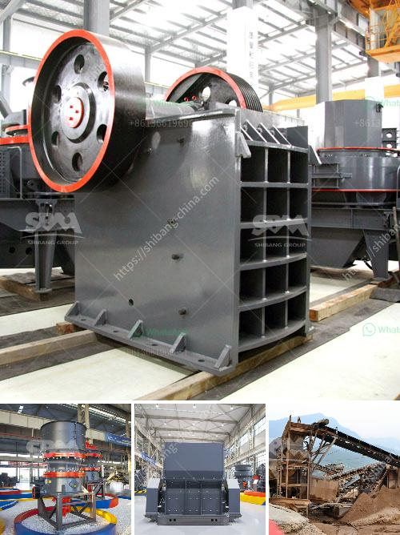

<h3>cost of setting up gypsum processing factory</h3>
Gypsum, a mineral widely used in our everyday lives, offers numerous applications across various industries. From construction and agriculture to pharmaceuticals and cosmetics, gypsum's versatility has made it a sought-after material globally. For entrepreneurs and investors interested in entering the gypsum processing market, understanding the costs associated with setting up a factory is pivotal.

Before diving into the cost analysis, let's briefly discuss the key aspects of setting up a gypsum processing factory. A gypsum processing factory primarily entails procuring gypsum resources, establishing manufacturing processes, arranging necessary machinery and equipment, and addressing legal and environmental requirements.

The cost of establishing a gypsum processing factory can vary significantly based on several factors. However, to provide a general idea, let's consider some of the primary expenses involved:

Acquiring a suitable plot of land, with sufficient space for production facilities and storage, is an essential initial investment. The cost of land varies depending on the location and availability, making it difficult to estimate precisely. Additionally, the necessary infrastructure, such as roads, electricity, and water supply, needs to be considered.

Investing in state-of-the-art machinery and equipment is crucial for efficient gypsum processing. This includes crushers, grinding mills, calciners, conveyors, and packaging machinery, among others. The cost of machinery can range from moderate to high, depending on the desired production capacity and technological advancement.

Skilled workers are essential for the successful operation of a gypsum processing factory. Personnel requirements include engineers, technicians, machine operators, laboratory professionals, and administrative staff. Proper allocation of manpower within the factory is crucial for maximizing efficiency and productivity.

Procuring a steady supply of gypsum is critical. The cost of obtaining gypsum will depend on factors such as the proximity of the factory to the gypsum mines or quarries, transportation costs, and contractual agreements with suppliers.

Adhering to local laws and regulations is an integral part of setting up any factory. Obtaining operating licenses, environmental permits, and other necessary certifications adds to the overall investment. It is advisable to consult experts or legal professionals to navigate the regulatory landscape effectively.

Setting up a gypsum processing factory has the potential for profitability, considering the broad range of industries dependent on gypsum-based products. While the costs associated with establishing a factory will vary based on several factors, careful planning, market analysis, and feasibility studies can provide a more accurate estimation. By understanding and carefully managing these costs, entrepreneurs and investors can make informed decisions regarding the setup of a gypsum processing factory, ensuring long-term success in this thriving industry.

Ultimately, the investment in a gypsum processing factory with proper planning and efficient execution can prove to be a prudent and lucrative decision.
<h3>Contact us</h3><ul><li><strong>Whatsapp:&nbsp;<a href="https://wa.me/8613661969651">+8613661969651</a></strong></li><li><a href="https://swt.shibang-china.com/?git&amp;zhl&amp;cost of setting up gypsum processing factory"><strong>Online Service(chat now)</strong></a></li></ul><h3>Related</h3><ul><li><a href='concrete crusher in kenya.md'>concrete crusher in kenya</a></li><li><a href='china cone crusher.md'>china cone crusher</a></li><li><a href='crusher plant in nigeria pakistan.md'>crusher plant in nigeria pakistan</a></li><li><a href='stone crushers companies in tanzania.md'>stone crushers companies in tanzania</a></li><li><a href='used conveyor belt in kenya.md'>used conveyor belt in kenya</a></li></ul>