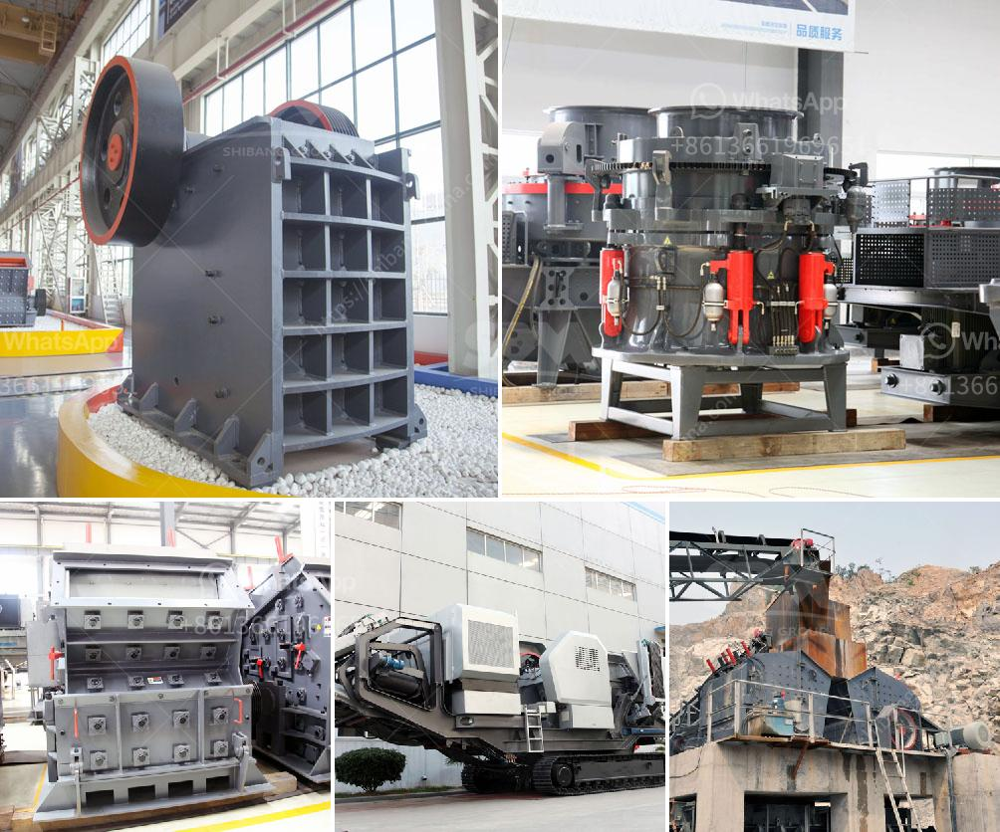

<h3>cost of stone crushing machine stone crusher quarry</h3>
The stone crusher quarry is a mining machine that is used to break down large stones into smaller pieces. Stone crusher quarry has the following advantages over traditional stone crushers: efficiency, mobility, cost-effectiveness, and environmentally friendly.

The mobile stone crusher quarry has been developed to crush stones on site and reduce the construction costs. It is characterized by a compact design and efficient performance. The machine is equipped with a reliable and eco-friendly diesel engine, which helps reduce the CO2 emissions.

One of the major advantages of the stone crusher quarry is its flexibility and mobility. It can be easily moved from one site to another, making it suitable for construction projects that require stone crushing at multiple locations. The machine can also be transported on a trailer, which further enhances its flexibility and mobility.

In terms of cost-effectiveness, the stone crusher quarry is an affordable option. The machine is designed to ensure that the stone crushing process is cost-effective and efficient. By reducing the size of the stones, it allows for greater operational efficiency and reduced transportation costs. Additionally, the diesel engine helps save on fuel costs.

The stone crusher quarry is also environment-friendly. By crushing stones on site, it reduces the pollution caused by transporting them to construction sites. Moreover, the machine is equipped with a dust suppression system, which ensures that the surrounding environment remains clean.

In conclusion, the stone crusher quarry is a mining machine that offers impressive benefits compared to traditional stone crushers. Its compact and efficient design, flexibility, and mobility make it suitable for construction projects that require stone crushing at multiple locations. Moreover, it is cost-effective and environmentally friendly. Investing in a stone crusher quarry is a wise choice for any construction company or individual looking to save time, cost, and resources while ensuring high-quality stone crushing.
<h3>Contact us</h3><ul><li><strong>Whatsapp:&nbsp;<a href="https://wa.me/8613661969651">+8613661969651</a></strong></li><li><a href="https://swt.shibang-china.com/?git&amp;zhl&amp;cost of stone crushing machine stone crusher quarry"><strong>Online Service(chat now)</strong></a></li></ul><h3>Related</h3><ul><li><a href='project report on mini kaolin mining crusher.md'>project report on mini kaolin mining crusher</a></li><li><a href='price of granite crusher tons per hour.md'>price of granite crusher tons per hour</a></li><li><a href='small sacle crushers in zambia.md'>small sacle crushers in zambia</a></li><li><a href='industrial vibrator feeders.md'>industrial vibrator feeders</a></li><li><a href='marble production line germany.md'>marble production line germany</a></li></ul>