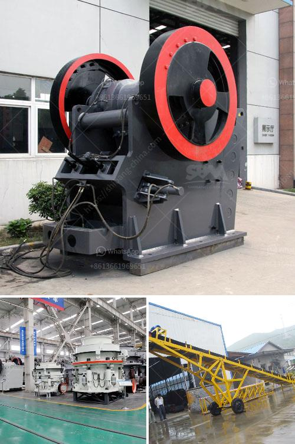

<h3>cost of stone crushing plant</h3>
The stone crushing plant demands set by the customers in Indian construction and mining industry is quite high. As a contractor, big or small, the key concern is performance of crushing plants. SBM, a world leader in crushing technology launches the mobile stone crushing series – the ultimate work horse for Indian construction and mining industry. The cost of stone crushing plant varies from plant to plant. In India, the Stone Crushing Industry sector is estimated to have an annual turnover of Rs. 5000 crore (equivalent to over US$ 1 billion) and is therefore an economically important sector. The sector is estimated to be providing direct employment to over 500,000 people engaged in various activities such as mining, crushing plant, transportation of mined stones and crushed products etc. Most of these personnel are from rural and economically backward areas where employment opportunities are limited and therefore it carries greater significance in terms of social importance in rural areas. It is a source of earning for uneducated poor unskilled rural people.

In Stone Crushing Plant, jaw crusher is used as primary crusher machine, when big stones are crushed smaller after jaw crusher, they are transferred to impact crusher or cone crusher for secondary crushing, then go through the stone shapping machine for getting cubic size.

Using screening machine to screen out the suitable building aggregates, while the unsuitable stones return to the crusher machine for re-crushing. Stone crusher plant that is apt for crushing stones and ores in uniform size for the further process. The design is safe and comes with no chances of splinter spillage.

The mobile stone crushing plant mainly consists of vibrating feeder, jaw crusher, cone crusher or impact crusher, vibrating screen, belt conveyor and control system, etc. It is completely capable to crush and screen limestone, marble, granite, basalt, river gravel and other hard stone materials, and produce sand & gravels with various granularities for construction and building industry.

We are able to design and manufacture complete crushing plants with capacity from 30tph to 500tph, and to provide optimum and most economical solutions according to customers' requirements on stone specifications, capacity, application, etc.

The investment cost of a stone crushing plant is mainly related to raw materials, equipment, and labor involved in the crushing process. The size of the site for obtaining the raw materials refers to the mounted location of the mobile crushing plant equipment. As the production scale of each project is different, the corresponding requirements for the configuration of the equipment are different, so the price is different. In addition, the production of finished stone materials is also subject to the processing volume of the finished product materials, and higher processing volumes require more crushing equipment.

Another important factor is the hourly output of the crushing plant. This determines the capacity and quality of the final products. There are two types of crushing plants: stationary crushing plant and mobile crushing plant. The stationary crushing plant requires a specific production capacity while the mobile crushing plant is convenient to move and can be directly used on the site.

In conclusion, the cost of stone crushing plant is diverse based on the above factors. Like a trusted manufacturer and exporter, SBM can provide the new and used stone crushing machine for sale. The stone crushing plant accounts for about 70% of the power consumption in the whole production process. Therefore, it is necessary to reduce the power consumption of the equipment. Therefore, reducing the energy consumption of the stone crushing plant is the key. In this process, granite can be used as a reducing agent for smelting iron, and when such a reducing agent is found, it can be used not only as a reducing agent, but also for smelting other metals.

Overall, the cost of stone crushing plant with 300-500 tph includes the equipment investment, labor cost, transportation cost, and the energy consumption, maintenance, and running cost. Finally, it should be considered that the quality of the stone production line, such as the durability, wear resistance of equipment, and the final output quality are the world's top priority. It is the high-quality stones that also get the good reputation in the market.
<h3>Contact us</h3><ul><li><strong>Whatsapp:&nbsp;<a href="https://wa.me/8613661969651">+8613661969651</a></strong></li><li><a href="https://swt.shibang-china.com/?git&amp;zhl&amp;cost of stone crushing plant"><strong>Online Service(chat now)</strong></a></li></ul><h3>Related</h3><ul><li><a href='crushers for granite aggregate.md'>crushers for granite aggregate</a></li><li><a href='small diesel engine jaw crusher.md'>small diesel engine jaw crusher</a></li><li><a href='turkey crusher company.md'>turkey crusher company</a></li><li><a href='low speed crusher suppliers in china.md'>low speed crusher suppliers in china</a></li><li><a href='used primary crushers for sale.md'>used primary crushers for sale</a></li></ul>