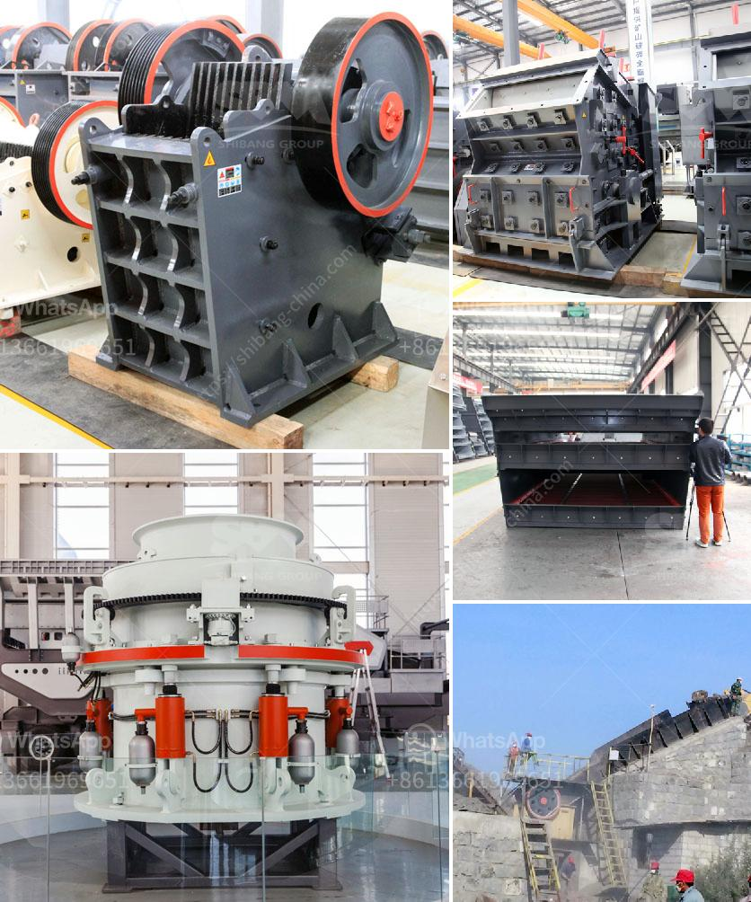

<h3>cost of tph stage crushing plant</h3>
The evolution of technology has prompted the need for new solutions in the crushing and screening industry. As modern machinery becomes increasingly advanced, the cost of producing the necessary aggregate materials required for construction projects continues to rise. In response to this challenge, the concept of a cost-efficient, three-stage crushing plant has gained popularity amongst contractors and project managers.

A three-stage crushing plant efficiently reduces the size of raw material into valuable base materials, ensuring that construction projects stay on track and within budget. The plant consists of a primary jaw crusher, secondary cone crusher, and tertiary vertical shaft impact crusher. The three stages break down the raw material and further refine it into the desired aggregate fraction.

When considering the cost of a three-stage crushing plant, it is essential to consider the initial investment, operational costs, and maintenance. The initial investment includes purchasing equipment, installation, and infrastructure development. While this may seem like a significant expense, the long-term benefits outweigh the initial costs.

Operational costs primarily consist of fuel, electricity, and labor. The reduction in labor cost compared to manually operated crushing plants is a substantial advantage, as the three stages are automated, facilitating efficient and continuous production processes. Additionally, the advanced technology employed in a three-stage crushing plant allows for easy monitoring and control of the production flow, helping to optimize operational costs.

Maintenance costs are also a factor to consider in the overall cost of a three-stage crushing plant. Regular maintenance and parts replacement ensure the longevity and optimal performance of the equipment. However, with proper maintenance and the use of high-quality components, the maintenance costs of a three-stage crushing plant can be minimized.

In conclusion, a three-stage crushing plant offers a cost-efficient alternative to traditional crushing methods. Although the initial investment may seem significant, the long-term benefits outweigh the costs. With advanced automation and efficient production processes, the operational costs are minimized. Proper maintenance ensures the longevity of the equipment, keeping maintenance costs under control. Ultimately, a well-designed and properly maintained three-stage crushing plant can be a valuable asset for any construction project.
<h3>Contact us</h3><ul><li><strong>Whatsapp:&nbsp;<a href="https://wa.me/8613661969651">+8613661969651</a></strong></li><li><a href="https://swt.shibang-china.com/?git&amp;zhl&amp;cost of tph stage crushing plant"><strong>Online Service(chat now)</strong></a></li></ul><h3>Related</h3><ul><li><a href='limestone grinding roller mill.md'>limestone grinding roller mill</a></li><li><a href='gyratory crusher advantages and disadvantages.md'>gyratory crusher advantages and disadvantages</a></li><li><a href='raymond mill in kenya.md'>raymond mill in kenya</a></li><li><a href='coal crushing plant in pakistan.md'>coal crushing plant in pakistan</a></li><li><a href='crusher and screening plant.md'>crusher and screening plant</a></li></ul>