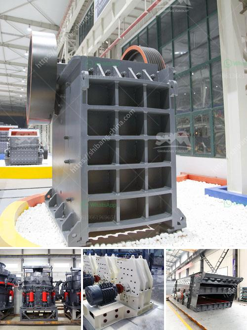

<h3>cost of vertical roller mill</h3>
Vertical roller mill (VRM) refers to the industrial equipment used to grind raw materials into finished materials in the cement manufacturing process. It plays an important role in cement plants and power plants by generating a certain particle size distribution and increasing the efficiency of the grinding system. However, the cost of a vertical roller mill can vary greatly depending on factors such as the manufacturer, the equipment configuration, and the specific application.

One of the key factors that influence the cost of a vertical roller mill is the brand reputation of the manufacturer. Established manufacturers with a solid track record in the industry tend to offer more reliable products with better after-sales service. Although their prices may be slightly higher, customers can have greater peace of mind knowing that they are investing in a trustworthy product. On the other hand, new manufacturers or those with a less established reputation may offer more competitive prices to attract customers, but their products may come with higher risks.

The cost of a vertical roller mill also depends on the equipment configuration. There are multiple variations of VRMs available on the market, each with different features and capabilities. For example, some mills are equipped with a high-efficiency separator that improves the separation of grounded materials, resulting in higher overall efficiency. Additionally, some mills have additional components such as pre-grinders or pre-crushers that help reduce the size of the feed material before it enters the mill, further enhancing the efficiency of the grinding process. However, these additional features can significantly increase the cost of the equipment.

Another factor that affects the cost of a vertical roller mill is the specific application for which it is being used. Different industries have different requirements for grinding, and thus, the design and specifications of the mill may vary accordingly. For example, a vertical roller mill used in the cement industry may require more robust materials and a specialized design to handle the high wear and temperature conditions in the cement mill. Consequently, these specialized mills may have a higher cost compared to those used in other industries.

Apart from the initial purchase cost, it is also important to consider the operational costs associated with a vertical roller mill. These include costs such as energy consumption, maintenance, and spare parts. Modern VRMs are designed to have low energy consumption, but the actual power consumption can vary depending on the material properties and the grinding conditions. Likewise, regular maintenance and the availability of spare parts are crucial for ensuring the reliability and longevity of the mill. These considerations should also be taken into account when evaluating the overall cost of a vertical roller mill.

In conclusion, the cost of a vertical roller mill can vary significantly depending on factors such as the brand reputation, equipment configuration, and specific application. It is essential for customers to carefully evaluate these factors to make an informed decision. As with any investment, finding the right balance between cost and performance is crucial in maximizing the value of a vertical roller mill.
<h3>Contact us</h3><ul><li><strong>Whatsapp:&nbsp;<a href="https://wa.me/8613661969651">+8613661969651</a></strong></li><li><a href="https://swt.shibang-china.com/?git&amp;zhl&amp;cost of vertical roller mill"><strong>Online Service(chat now)</strong></a></li></ul><h3>Related</h3><ul><li><a href='equipment for dimension stone production.md'>equipment for dimension stone production</a></li><li><a href='jaw crusher for sale in ghana.md'>jaw crusher for sale in ghana</a></li><li><a href='malaysia grinder hammer mill manufacturer.md'>malaysia grinder hammer mill manufacturer</a></li><li><a href='sand sieve machine philippines.md'>sand sieve machine philippines</a></li><li><a href='mining crusher machinery tanzania.md'>mining crusher machinery tanzania</a></li></ul>