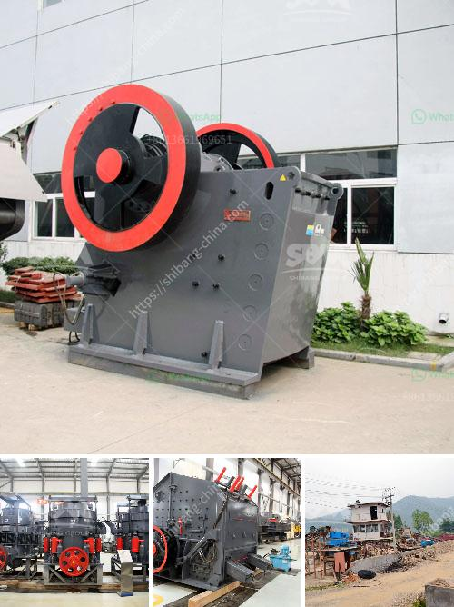

<h3>cost per tonne crushing iron ore</h3>
The cost per tonne of crushing iron ore is typically higher than the average price per tonne of crushed ore in the market. This is because the costs of crushing are quite significant and can account for a large portion of the overall mining expenses.

The crushing process involves multiple stages, including primary crushing, secondary crushing, and tertiary crushing. Each stage requires specific machinery and equipment that come at a high cost. Additionally, the energy consumption during crushing is substantial, which also contributes to the overall expense. These factors drive up the cost per tonne of crushing iron ore.

Moreover, the hardness and size of the iron ore deposit also impact the cost per tonne. Harder ores require more energy and wear down crushing equipment faster, leading to higher maintenance and replacement costs. Similarly, larger size boulders or rocks may need additional machinery or more extensive processing, increasing the cost per tonne.

Other cost factors include labor, transportation, and infrastructure. Skilled labor is required to operate and maintain the crushing machinery, adding to the overall expense. Transporting the iron ore from the mine to the crushing plant or the market also implies transportation costs, whether by road, rail, or sea. Furthermore, maintaining infrastructure such as roads and railways adds to the overall cost.

To optimize cost efficiency, mining companies often invest in advanced crushing technology and equipment. Investing in research and development to improve the efficiency of the crushing process and reduce energy consumption can help lower the cost per tonne. Exploring alternative sources of energy, like renewable energy, may also help reduce operational expenses.

In conclusion, the cost per tonne of crushing iron ore is influenced by various factors, including machinery, energy consumption, size, and hardness of the ore deposit, labor, transportation, and infrastructure costs. Investing in efficient equipment and technologies while exploring alternative energy sources can help reduce these costs and improve the competitiveness of iron ore mining operations.
<h3>Contact us</h3><ul><li><strong>Whatsapp:&nbsp;<a href="https://wa.me/8613661969651">+8613661969651</a></strong></li><li><a href="https://swt.shibang-china.com/?git&amp;zhl&amp;cost per tonne crushing iron ore"><strong>Online Service(chat now)</strong></a></li></ul><h3>Related</h3><ul><li><a href='coal mining equipment for sale.md'>coal mining equipment for sale</a></li><li><a href='quartz silica crushing unit.md'>quartz silica crushing unit</a></li><li><a href='used track mounted stone crusher.md'>used track mounted stone crusher</a></li><li><a href='quartz stone crusher application.md'>quartz stone crusher application</a></li><li><a href='vsi crusher plants in uae.md'>vsi crusher plants in uae</a></li></ul>