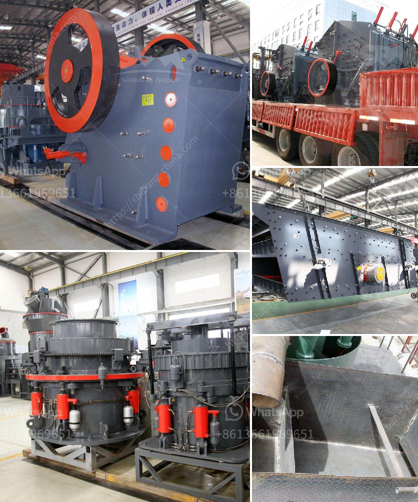

<h3>cost000 tpd cement project ore processing</h3>
Ore processing is an integral part of the mining cycle that involves extracting the desirable minerals from the orebody. The process requires significant investment in infrastructure, equipment, and manpower. A cost-effective approach is crucial to ensure the viability of the project, especially in the case of a TPD (Tons Per Day) cement project.

A typical TPD cement project involves extracting raw materials such as limestone, clay, shale, or iron ore from a mine, crushing them into smaller pieces, and then grinding them into a fine powder. This powder, known as cement, is then mixed with water to create concrete, the building material used for constructing various structures.

To make the ore processing step cost-effective, several factors need to be considered. Firstly, the location of the mine plays a crucial role in determining transportation costs. Ideally, the mine should be situated near the cement plant to minimize transportation expenses. This reduces fuel consumption and ensures a steady supply of raw materials, thus driving down costs.

Moreover, efficient extraction and processing techniques are essential for cost optimization. Modern technologies have made it possible to extract ore more efficiently, resulting in higher yields and lower operational costs. Additionally, utilization of advanced crushing and grinding equipment can further enhance productivity while reducing energy consumption.

Furthermore, the integration of automation and digitalization in the ore processing plant can significantly reduce labor costs. Automated systems can monitor and control various processes, reducing the need for manual intervention. This not only improves operational efficiency but also ensures consistent product quality.

The scale of the TPD cement project also plays a vital role in cost-effectiveness. Larger-scale projects often benefit from economies of scale, where the cost per unit decreases as production volume increases. Processing ore on a larger scale allows for better utilization of equipment and infrastructure, ultimately reducing overall costs.

Collaboration with suppliers and contractors is another important aspect of cost optimization. Establishing long-term partnerships with reliable suppliers ensures a stable supply chain and potentially better pricing. Engaging skilled contractors for specialized tasks can also minimize project costs as they bring expertise and efficiency to the table.

Additionally, environmental considerations play a significant role in cost-effective ore processing. Adopting sustainable practices not only reduces the project's carbon footprint but also avoids potential fines and penalties. Implementing modern technologies for waste management and water recycling can minimize operational costs and ensure compliance with environmental regulations.

In conclusion, cost-effective ore processing is crucial for the success of a TPD cement project. By considering factors such as location, extraction techniques, automation, scale, supplier collaboration, and environmental sustainability, project stakeholders can optimize costs while ensuring smooth operations. Embracing innovative technologies and sustainable practices will pave the way for a profitable and environmentally conscious cement project of any scale.
<h3>Contact us</h3><ul><li><strong>Whatsapp:&nbsp;<a href="https://wa.me/8613661969651">+8613661969651</a></strong></li><li><a href="https://swt.shibang-china.com/?git&amp;zhl&amp;cost000 tpd cement project ore processing"><strong>Online Service(chat now)</strong></a></li></ul><h3>Related</h3><ul><li><a href='jaw crusher for hire south africa for limestone.md'>jaw crusher for hire south africa for limestone</a></li><li><a href='coltan processing plant prices.md'>coltan processing plant prices</a></li><li><a href='the cost of grinding machine in uganda.md'>the cost of grinding machine in uganda</a></li><li><a href='hammer mill for quartz rock.md'>hammer mill for quartz rock</a></li><li><a href='river stone crusher.md'>river stone crusher</a></li></ul>