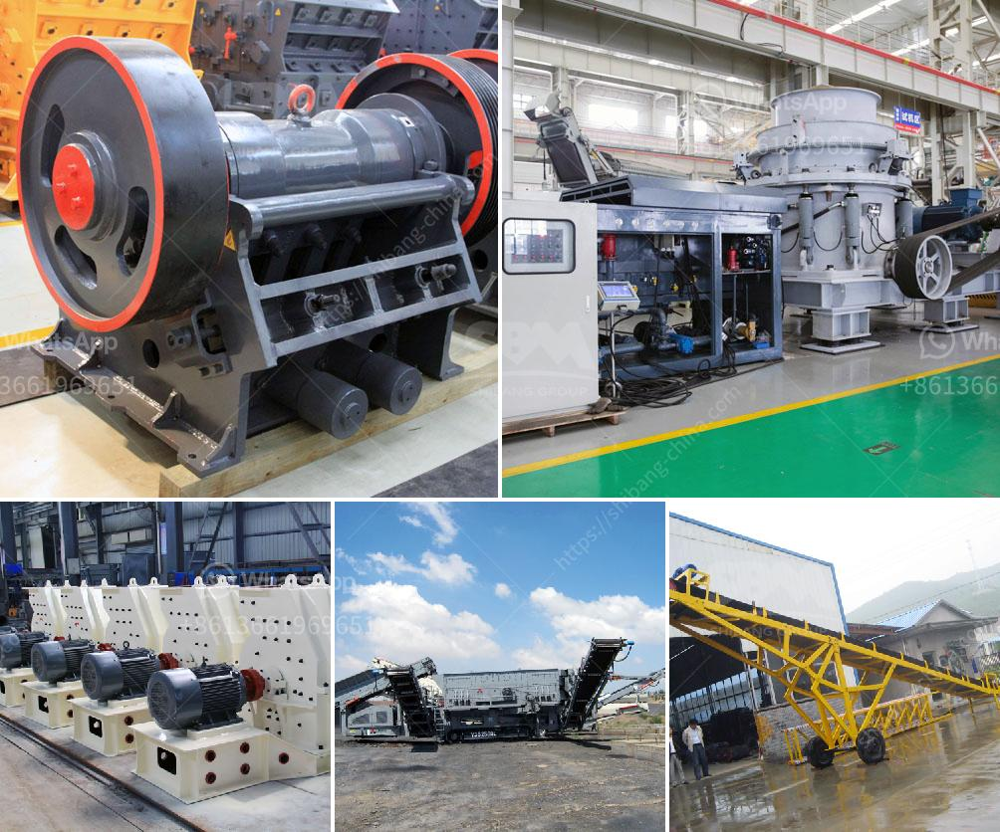

<h3>costs a stone crushing machine when a stone crusher</h3>
Costs of a Stone Crushing Machine: The stone crushing plant is mainly composed of vibrating feeder, jaw crusher, impact crusher, vibrating screen, belt conveyor, centralized electric control and other equipment. The designed output is generally 50-800t/h, and it can be equipped with different crushing equipment to perform different crushing processes. With the increasing demand for aggregates, the stone crushing industry is becoming more and more popular. However, when investing in a stone crushing machine, users should consider various factors such as the equipment's quality and performance, the cost of manufacturing and maintaining the equipment, and the market demand for output. 

One of the factors that affect the cost of purchasing a stone crushing machine is the quality. High-quality equipment will always have a higher price, but it will have a long service life, a stable performance, and less maintenance cost in the long run. On the other hand, low-quality equipment might be cheaper initially, but it will often require frequent repairs, replacements, and higher maintenance costs, resulting in increased overall expenses. Therefore, it is crucial to invest in high-quality stone crushing machines, even if they appear to be more expensive at first.

Another cost to consider is the manufacturing cost of the stone crushing machine. This includes the cost of raw materials, labor, and overhead expenses. The cost of raw materials can vary depending on the type of stone being crushed and its availability in the market. Labor costs will also depend on the complexity of the manufacturing process and the number of workers involved. Additionally, overhead expenses such as rent, depreciation, and taxes will contribute to the manufacturing cost. To minimize manufacturing costs, stone crushing machine manufacturers should optimize their production processes and reduce unnecessary expenses.

Apart from the manufacturing cost, maintaining and repairing the stone crushing machine can also incur significant expenses. Regular maintenance is essential to prolong the machine's service life and ensure its optimal performance. This can include lubrication of moving parts, inspection of electrical systems, and replacement of worn-out components. Repairing damaged parts or components is another aspect to consider, and the cost can vary depending on the severity of the damage and the availability of spare parts. It is advisable to choose a stone crushing machine that is easy to maintain and repair, with readily available spare parts, to minimize downtime and maintenance costs.

Lastly, the market demand for output should be considered when investing in a stone crushing machine. The higher the market demand for aggregates, the more profitable the investment will be. Before purchasing a crushing machine, it is essential to conduct market research and analyze the potential demand for aggregates. This will help determine the required production capacity, which will then influence the type and size of the crushing equipment needed. Investing in a machine that can meet the market demand will lead to higher returns on investment.

In conclusion, there are various costs to consider when investing in a stone crushing machine. These include the initial purchase cost, manufacturing cost, maintenance cost, and the potential return on investment based on market demand. By carefully considering these factors and making informed decisions, investors can maximize their profitability and ensure the long-term success of their stone crushing business.
<h3>Contact us</h3><ul><li><strong>Whatsapp:&nbsp;<a href="https://wa.me/8613661969651">+8613661969651</a></strong></li><li><a href="https://swt.shibang-china.com/?git&amp;zhl&amp;costs a stone crushing machine when a stone crusher"><strong>Online Service(chat now)</strong></a></li></ul><h3>Related</h3><ul><li><a href='how to set up crusher.md'>how to set up crusher</a></li><li><a href='turkish manufacturer belt conveyor.md'>turkish manufacturer belt conveyor</a></li><li><a href='machines use for mining sand from river.md'>machines use for mining sand from river</a></li><li><a href='concrete crusher business proposal.md'>concrete crusher business proposal</a></li><li><a href='hammer mill for sale south africa.md'>hammer mill for sale south africa</a></li></ul>