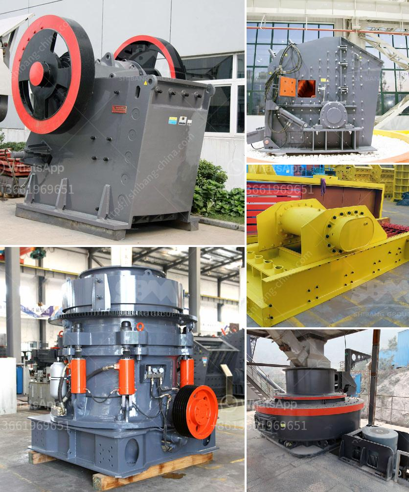

<h3>costs of calcium carbonate making machinery in japan</h3>
The costs of calcium carbonate making machinery in Japan cover a wide range of prices. There is no standardized pricing system, and each manufacturer or supplier sets its own prices based on various factors.

One of the primary factors that influence the cost of calcium carbonate making machinery in Japan is the quality of the equipment. High-quality machinery is typically priced higher than lower-quality alternatives. This is because high-quality machinery often incorporates advanced technologies and materials, which increases its production efficiency and overall performance.

Furthermore, the size and capacity of the machinery also play a significant role in determining its cost. Larger and more powerful machines tend to have higher price tags due to their ability to produce a larger volume of calcium carbonate in a shorter period. However, the capacity requirements will depend on the specific needs of the manufacturer or the production scale desired.

The brand reputation and market position of the machinery supplier also impact the pricing. Well-established manufacturers with a long history of producing reliable and efficient machinery tend to charge higher prices for their products compared to lesser-known or new entrants in the market.

Another factor that can affect the cost is the level of automation and technology integration in the machinery. Advanced features such as computerized systems, sensors, and control mechanisms can significantly increase the price of calcium carbonate making machinery. However, these features can also improve efficiency, reduce maintenance costs, and enhance product quality, making the investment worthwhile in the long run.

In addition to the cost of the machinery itself, buyers should also consider other expenses such as delivery, installation, and after-sales services. These additional costs vary among different suppliers and should be considered when making a purchase decision.

It is worth mentioning that the costs of calcium carbonate making machinery in Japan can be influenced by the currency exchange rates. International buyers should consider this factor when comparing prices in their local currency.

To get the best value for money, potential buyers should conduct thorough research on the various machinery options available in the market. Comparing prices, functionalities, technical specifications, and customer reviews from different suppliers will help in making an informed decision.

Lastly, evaluating the long-term benefits and return on investment is crucial when considering the cost of calcium carbonate making machinery. Although high-quality and advanced machinery may have a higher upfront cost, it can lead to improved performance, higher productivity, and cost savings in the long run.

In conclusion, determining the costs of calcium carbonate making machinery in Japan involves considering multiple factors such as the quality of the equipment, size and capacity, brand reputation, level of automation, and additional expenses. Conducting thorough research and considering long-term benefits will assist in making the right investment decision for manufacturers seeking efficient and reliable machinery.
<h3>Contact us</h3><ul><li><strong>Whatsapp:&nbsp;<a href="https://wa.me/8613661969651">+8613661969651</a></strong></li><li><a href="https://swt.shibang-china.com/?git&amp;zhl&amp;costs of calcium carbonate making machinery in japan"><strong>Online Service(chat now)</strong></a></li></ul><h3>Related</h3><ul><li><a href='70 tph limestone crusher weight.md'>70 tph limestone crusher weight</a></li><li><a href='ballast quarry crusher machines.md'>ballast quarry crusher machines</a></li><li><a href='types of coal crusher used in industry.md'>types of coal crusher used in industry</a></li><li><a href='labratory hammer mill.md'>labratory hammer mill</a></li><li><a href='chromium ore mining equipmentr.md'>chromium ore mining equipmentr</a></li></ul>