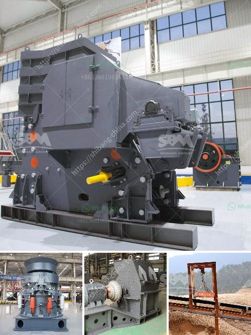

<h3>course sand manufacturers in india</h3>
India, known for its diverse landscapes, is blessed with beautiful sandy beaches along its vast coastline. But did you know that India is not just a source of natural sand, but also a hub for course sand manufacturers? With its highly skilled labor force and advanced technology, India has emerged as a leading player in the sand manufacturing industry.

Course sand, also known as coarse sand or sharp sand, is a type of sand with larger particles compared to fine sand. It is commonly used in construction projects, such as concrete production and road building. The demand for course sand is immense, considering the rapid pace of infrastructure development in India.

One of the key reasons behind India's success in the course sand manufacturing sector is the availability of high-quality raw materials. India has abundant reserves of quartz, granite, and other minerals, which are essential components for course sand production. These raw materials are extracted from quarries located across various parts of the country.

Another factor that has contributed to the growth of course sand manufacturers in India is the presence of advanced manufacturing facilities. These manufacturers utilize state-of-the-art machinery and equipment to process raw materials into course sand. The manufacturing process involves crushing and screening the raw materials to produce desired particle sizes and shape.

India boasts a large number of course sand manufacturers spread across different states. These manufacturers cater to the needs of both domestic and international markets. They offer a wide range of course sand products with varying specifications to meet the diverse requirements of customers.

In recent years, there has been a significant emphasis on sustainable sand mining practices in India. To preserve the environment and minimize the adverse impact of sand mining, both the government and manufacturers have adopted responsible mining techniques. This includes measures like reclamation of mined areas, efficient water management, and adoption of eco-friendly technologies for sand extraction and processing.

India's course sand manufacturers not only prioritize environmental sustainability but also adhere to strict quality standards. The manufactured course sand undergoes rigorous quality checks to ensure it meets the required specifications. These quality checks involve testing the sand for parameters like grain size, shape, strength, and chemical composition.

Furthermore, course sand manufacturers in India are known for their professionalism and commitment to customer satisfaction. They have a robust distribution network that ensures timely delivery of the sand to construction sites, even in remote areas. Their customer-centric approach and focus on reliability have earned them a reputation as trusted suppliers in the industry.

Indian course sand manufacturers have also ventured into international markets, exporting their products to countries around the world. The competitive pricing and high-quality standards have made Indian course sand a preferred choice for construction projects globally.

In conclusion, India's course sand manufacturing industry has witnessed remarkable growth in recent years. With abundant raw material availability, advanced manufacturing facilities, and emphasis on sustainability, Indian manufacturers have established themselves as key players in the global course sand market. Their commitment to quality and customer satisfaction further enhances their position as reliable suppliers. As India continues to develop its infrastructure, the demand for course sand is expected to rise, paving the way for further growth and innovation in this sector.
<h3>Contact us</h3><ul><li><strong>Whatsapp:&nbsp;<a href="https://wa.me/8613661969651">+8613661969651</a></strong></li><li><a href="https://swt.shibang-china.com/?git&amp;zhl&amp;course sand manufacturers in india"><strong>Online Service(chat now)</strong></a></li></ul><h3>Related</h3><ul><li><a href='diamond plant for sale in south africa.md'>diamond plant for sale in south africa</a></li><li><a href='stone crusher machine factory in cambodia.md'>stone crusher machine factory in cambodia</a></li><li><a href='manufacturers of stone crushers in usa.md'>manufacturers of stone crushers in usa</a></li><li><a href='roll crusher used equipment.md'>roll crusher used equipment</a></li><li><a href='conveyor belt manufacturing plant crushers equipment.md'>conveyor belt manufacturing plant crushers equipment</a></li></ul>