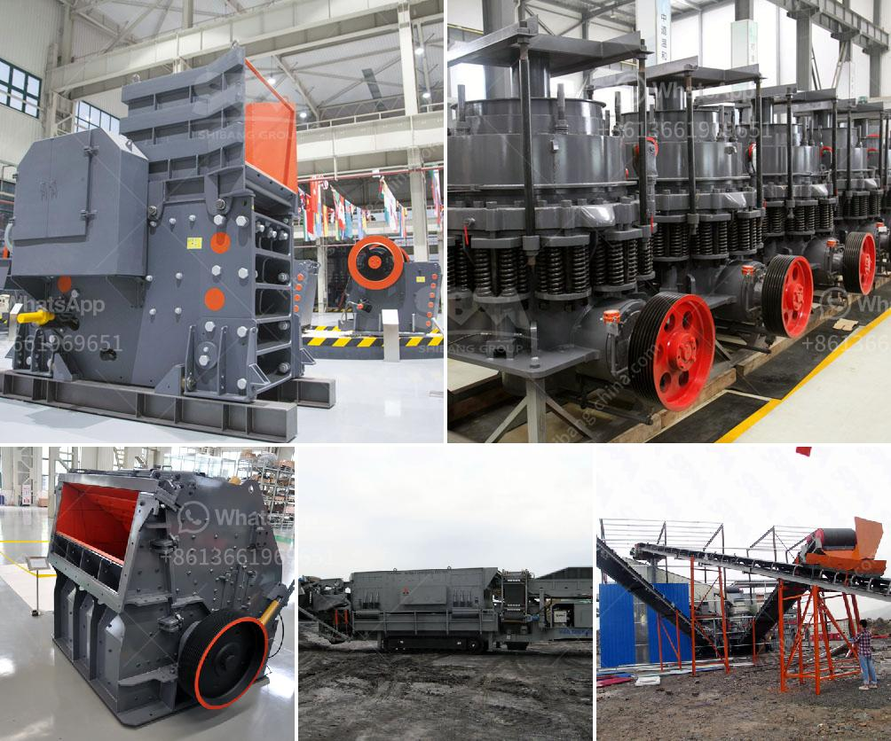

<h3>crawler mobile jaw crusher for sale</h3>
Rock crushers are in significantly large demand worldwide because of their multiple uses. The primary reason for their popularity is they are widely used in many industries, including mining, construction, metallurgy, and many others. If you want to buy a crawler mobile jaw crusher, it is essential to understand what your needs are. Many people believe that the crawler mobile jaw crusher sale offers huge benefits for the construction industry. It's important to remember that a crawler mobile jaw crusher is very portable and compact, allowing you to transport it easily from site to site.

Crawler mobile jaw crushers are known for their capabilities in the reduction and sizing of aggregates for construction purposes, such as highway contracts. These highly versatile machines can be used in a variety of applications, depending on the specific needs of your project. It is imperative to note that the crawler mobile jaw crusher is a heavy-duty machine, designed to crush rocks and minerals into smaller particles. The equipment is highly efficient and user-friendly, providing excellent productivity for a variety of crushing applications.

One of the standout features of the crawler mobile jaw crusher sale is the excellent mobility and compactness it provides. The machine is easy to transport and maneuver on-site, making it perfect for use in tight spaces and remote areas. This reduces the required amount of transportation and overall costs for your project. In addition, the crawler mobile jaw crusher's large crushing ratio and high capacity make it suitable for a wide range of applications, such as ores, concrete, and construction waste recycling.

The crawler mobile jaw crusher for sale in the market is very popular due to its unique advantages in a variety of applications. It adopts advanced hydraulic system and excellent control system to ensure the high degree of automation and efficiency. This mobile crusher plant is reliable, convenient to maintain, and has flexible configurations. It can be designed with a vibrating feeder, a jaw crusher, or a traditional cone crusher. It includes a crawler chassis that allows easy maneuverability around the work site, enabling efficient and timely completion of tasks.

Furthermore, the crawler mobile jaw crusher incorporates a range of innovative features that improve productivity, fuel efficiency, and safety. One such feature is the remote control operation, allowing operators to easily control the equipment from a distance. This not only enhances safety but also makes operation more comfortable, especially in hazardous conditions. Additionally, the machine's low emissions and environmental impact make it a sustainable choice for construction projects.

In conclusion, the crawler mobile jaw crusher sale has become very popular in recent years due to its unique advantages in the construction industry. It offers the perfect combination of mobility, efficiency, and safety, making it an ideal choice for various crushing applications. When selecting a crawler mobile jaw crusher, it is essential to consider factors such as the size and hardness of the material, the expected output, and the desired mobility. By analyzing these factors, you can choose the most suitable machine that meets your specific needs and delivers exceptional performance.
<h3>Contact us</h3><ul><li><strong>Whatsapp:&nbsp;<a href="https://wa.me/8613661969651">+8613661969651</a></strong></li><li><a href="https://swt.shibang-china.com/?git&amp;zhl&amp;crawler mobile jaw crusher for sale"><strong>Online Service(chat now)</strong></a></li></ul><h3>Related</h3><ul><li><a href='stone crusher machine factory in cambodia.md'>stone crusher machine factory in cambodia</a></li><li><a href='screening and crusher for sale.md'>screening and crusher for sale</a></li><li><a href='gypsum factory machines in india.md'>gypsum factory machines in india</a></li><li><a href='how much investment in bauxite crushing plant.md'>how much investment in bauxite crushing plant</a></li><li><a href='gypsum crusher supplier in uae.md'>gypsum crusher supplier in uae</a></li></ul>