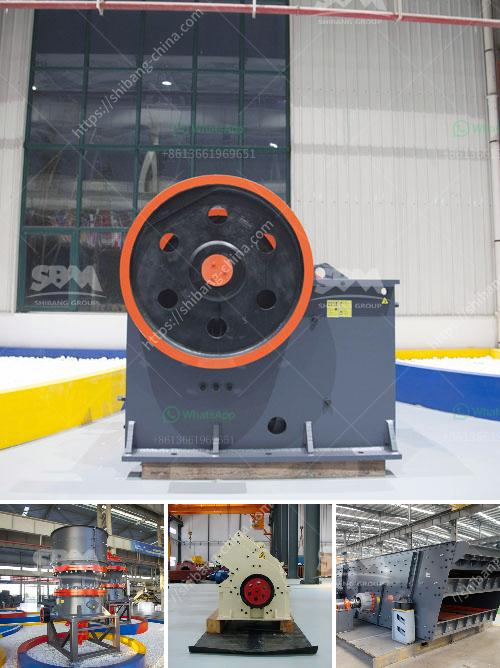

<h3>crawler portable crusher</h3>
Crawler portable crusher is a kind of efficient crushing equipment, which adopts self-drive mode, possesses advanced technology and complete function. Under any terrain condition, this equipment can get to anywhere of work place, in this way, it can decrease the operation to the material, in addition, it is also convenient to comprehensively assist the coordination of mechanical equipment. Compared with the fixed crusher, portable crawler crushing equipment is set by feeding, crushing, transmission and other process equipment as a whole, through process optimization to make the machine has the advantages of small volume, compact structure, large crushing ratio, low noise, simple structure, convenient operation, high efficiency and energy saving, stable transmission, reliable sealing, etc. It is in line with the domestic market demand.

The crawler portable crusher integrates material collecting, crushing and delivering as a whole. Through the optimization of technological process, mobile crusher enjoys the superior features of crushing, aggregate production and open-pit mining. And through the combination of different types of crawler-type mobile crushing and screening stations, the crawler mobile crusher can be divided into five series: portable crushing plant, portable jaw crusher, portable cone crusher, portable impact crusher and portable screening plant. With its own optimized design, excellent performance, high production efficiency and convenient maintenance, the crawler mobile crushing and screening plant can be applied to various conditions and easily adapt to different crushing processes.

Crawler portable crusher can be directly selected sites, directly to the site, without transport, directly to finished size, especially suitable for construction waste crushing. When processing construction waste, the crawler portable crusher plant can be divided into several processing operations, such as screening, crushing and so on. Its unique structure design, excellent performance advantages, the crawler portable crusher plant can also be equipped with multiple other devices according to various customer requirements.

In summary, the crawler portable crusher has the characteristics of intelligent remote control, excellent performance, space-saving, energy-saving and so on. It has been widely used in various fields, such as mining, metallurgy, building materials, highway, railway, water conservancy, construction waste recycling and so on. With the importance of environmental protection, the crawler portable crusher is welcomed by the majority of users with its reasonable price, stable performance and high cost performance ratio. It brings convenience to the crusher operation and guarantees the integrity of the finished product. The crawler portable crusher is an essential helper on mining and construction sites.
<h3>Contact us</h3><ul><li><strong>Whatsapp:&nbsp;<a href="https://wa.me/8613661969651">+8613661969651</a></strong></li><li><a href="https://swt.shibang-china.com/?git&amp;zhl&amp;crawler portable crusher"><strong>Online Service(chat now)</strong></a></li></ul><h3>Related</h3><ul><li><a href='small impact crusher.md'>small impact crusher</a></li><li><a href='enquiry crushing machine.md'>enquiry crushing machine</a></li><li><a href='cement formation process.md'>cement formation process</a></li><li><a href='calcium carbonate grinding industries in india.md'>calcium carbonate grinding industries in india</a></li><li><a href='crusher supplier saudi.md'>crusher supplier saudi</a></li></ul>